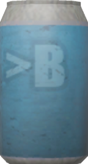

## 快捷链接

[主题源码](https://github.com/CaiJimmy/hugo-theme-stack) [主题文档](https://stack.jimmycai.com/config/) [Hugo 文档](https://gohugo.io/documentation/)

## 调试功能

### 清空 localStorage

<a class="link" href="javascript:void(0)" onclick="localStorage.clear();location.reload();">清空 localStorage</a>

### Eruda

URL 参数`eruda=true`。

    <a class="link" onclick="localStorage.setItem('active-eruda','true');location.reload();">启动Eruda</a>&nbsp;
    <a class="link" onclick="localStorage.removeItem('active-eruda');location.reload();">关闭Eruda</a>

### Cloudflare Zaraz 管理的网站统计

    
    <a class="link" href="javascript:void(0)" onclick="DisableAnalysis();location.reload();">添加禁用标记</a>&nbsp;
    <a class="link" href="javascript:void(0)" onclick="RmDisableAnalysis();location.reload();">删除禁用标记</a>

## 字体功能

### 使用霞鹜文楷字体

使用[LXGW WenKai Screen / 霞鹜文楷屏幕阅读版](https://github.com/CMBill/lxgw-wenkai-screen-web)。

    <a class="link" onclick="localStorage.setItem('LXGW-WenKai','true');location.reload();">打开</a>&nbsp;
    <a class="link" onclick="localStorage.removeItem('LXGW-WenKai');location.reload();">关闭</a>

## Firefox H.265/MPEG-H HEVC 视频播放

在`about:config`将`media.wmf.hevc.enabled`设为`1`。

## 默认图片作者

-   [Pawel Czerwinski](https://unsplash.com/@pawel_czerwinski)
-   [mymind](https://unsplash.com/@mymind)
-   [Luke Chesser](https://unsplash.com/@lukechesser)
-   [Codioful (Formerly Gradienta)](https://unsplash.com/@codioful)

## 调试信息

Git 提交和构建信息请参考页脚。

其他 Hugo 调试信息请参考 JavaScript 控制台。



## Written by Human, Not by AI

## 把罐子扔到垃圾桶里

这部分代码来自[Half-Life 2 Anniversary Update](https://www.half-life.com/en/halflife2/20th)。

    <!-- https://www.half-life.com/en/halflife2/20th -->
    <link href="physplay/css/physplay.css" rel="stylesheet" type="text/css" />
    
    
    
    
    
    

        

        

            用鼠标试试？
            用电脑试试？
        

        
        
        
        

        

        <fieldset id="sounddebug" class="debugUI">
            <legend>[DEV] Sound Effect Debug</legend>
            <ul>
                Loading...
            </ul>
        </fieldset>
        <fieldset id="physdebug" class="debugUI">
            <legend>[DEV] Physics Debug Config</legend>
            <ul></ul>
            <button onclick="phys.config.reset()">Reset Config</button>
        </fieldset>
        

            <canvas id="physCanvas"> </canvas>
        

        

    

