> 这里提到的所有信息都已经过时了，请参考[Hello Minecraft! Launcher](https://github.com/HMCL-dev/HMCL)的说明。

**本文内所有链接只保证发布时可用。**

### 如果您不想看这篇文章并且不在意游戏质量

[我的世界 Minecraft 中国版官方网站——您想玩的，这里都有](http://mc.163.com/)

### 为什么我们不建议使用 Minecraft 中国版

-   [引用材料](https://www.bilibili.com/video/BV1Gi4y1b7sa)



-   中国版的运行受不合理的网络连接限制
-   中国版游戏内容可能受中国政府的有关政策限制
-   知名 UP 主使用国际版
-   Minecraft 中国版更新速度慢
-   Minecraft 中国版前途渺茫
-   ……

---

# 教程开始

# Step 1:安装 Java

如果您已经在设备上安装了 Java，请[跳过这一段](#step-2%e8%8e%b7%e5%8f%96%e5%90%af%e5%8a%a8%e5%99%a8)。

## 获取 Java 安装包

### Java.com

您可以在[Java.com](https://www.java.com/zh_CN/)获取 Java 的各平台安装包。

前往[下载页](https://www.java.com/zh_CN/download/)并点击下载按钮，运行安装程序并安装。

> For Windows:
>
> 如果您不清楚该如何安装，请持续点击窗口中的“下一步”、“我同意 EULA”、“安装”直到安装成功。

### 网络问题？

限于中国特色的网络环境，您在下载 Java 完整安装包的过程中可能会遇到一些困难。这时，您可以向国内下载站寻求帮助。

在这里，我们建议使用[腾讯软件中心](https://pc.qq.com/)下载安装包。

网站上提供的 JRE(Java Runtime Environment,Java 运行环境)仍然是在线安装包，这时，我们要安装提供离线安装包的 JDK(Java Development Kit,Java 开发包)。

[Java SE Development Kit x86](https://pc.qq.com/detail/0/detail_18360.html) [安装包链接](https://dl.softmgr.qq.com/original/Development/jdk-8u191-windows-i586-8.0.1910.12.exe)

[Java SE Development Kit x64](https://pc.qq.com/detail/13/detail_56573.html) [安装包链接](https://dl.softmgr.qq.com/original/Development/jdk-8u191-windows-x64-8.0.1910.12.exe)

#### JRE 和 JDK 的区别？

JDK 包括了 Java 运行环境(JRE)、Java 工具和 Java 基础类库。

#### x86 & x64 ?

这里不作更多讲解，请右键单击“计算机”或“这台电脑”或“我的电脑”或“只要您打开它就能看到所有连接到这台设备的所有外接设备和驱动器或硬盘的那个图标”并点击“属性”，查看“系统类型”。

-   若其为 32 位操作系统或 x86 操作系统，使用 x86 安装包。
-   若其为 64 位操作系统，使用 x64 安装包。
-   若您不想分辨 x86 和 x64，请无视上述内容并直接选择 x86 安装包。
-   若您想用试错法确定安装包，请先运行 x64 安装包，若报错，使用 x86 安装包。

# Step 2:获取启动器

在这里，我们建议使用[Hello Minecraft! Launcher](https://hmcl.huangyuhui.net/)。

在[这里](https://hmcl.huangyuhui.net/download)选择 Windows（就是那个紫色的上面写着 Windows 的按钮）并下载，将下载的可执行文件放置在一个新建的文件夹（例如新建一个叫做“Minecraft”的文件夹）中。

# Step 3:下载 Minecraft

运行您刚刚下载的启动器（第一次启动可能缓慢）。

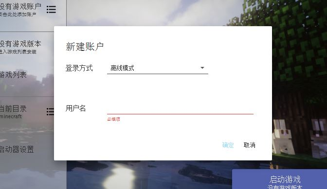

登录方式选择离线模式，在用户名中填入您希望在游戏内显示的名字（不建议使用中文或特殊字符），点击“确定”。

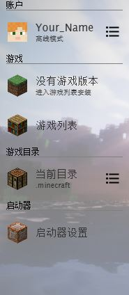

点击启动器设置，依网络情况选择下载源 BMCLAPI 或我的世界中文论坛。

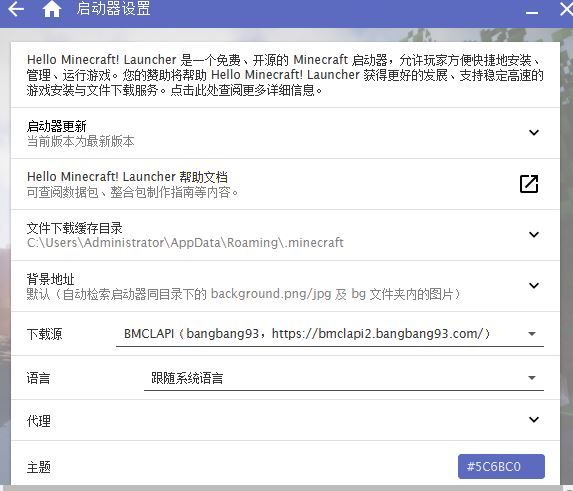

点击“没有游戏版本”，点击“安装新游戏版本”。

选择您需要的游戏版本，点击版本号（如“1.15.2”）。

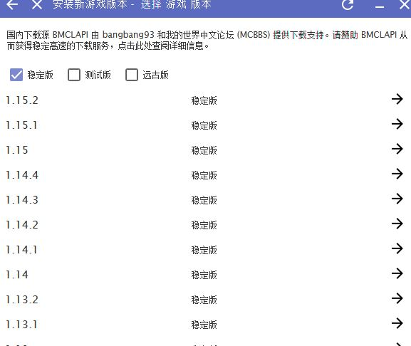

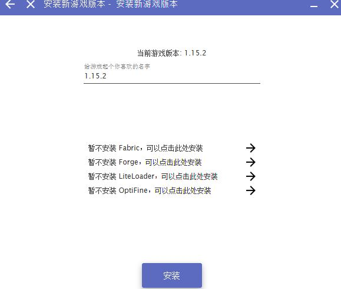

> 不建议的操作
>
> 如果您有意向安装 Mod，请选择安装 Forge 并选择 Forge 版本（建议使用最新版）。
>
> 如果您的 Mod 使用 Fabric 或 LiteLoader，请选择相应选项安装。
>
> 如果您有意向使用光影，请选择安装 OptiFine。
>
> 但是，我们并不建议在这里安装其他项目。

选择完成后，点击“安装”按钮。

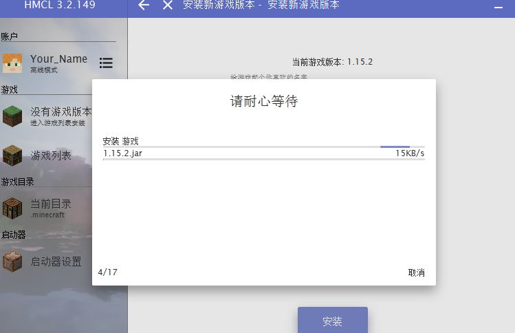

耐心等待游戏和资源文件下载完成。

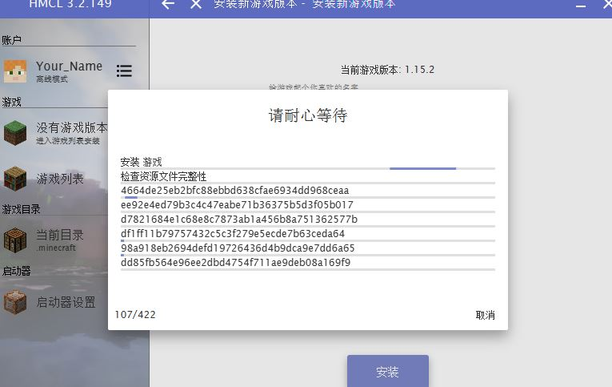

如果您选择了 Forge 或其他选项，等待安装完成。

安装**非**Minecraft 本体时，受限于中国特色的网络环境，您可能会在获取来自 Google 或 GitHub 的资源时遇到网络问题，请使用您自己的方法解决。

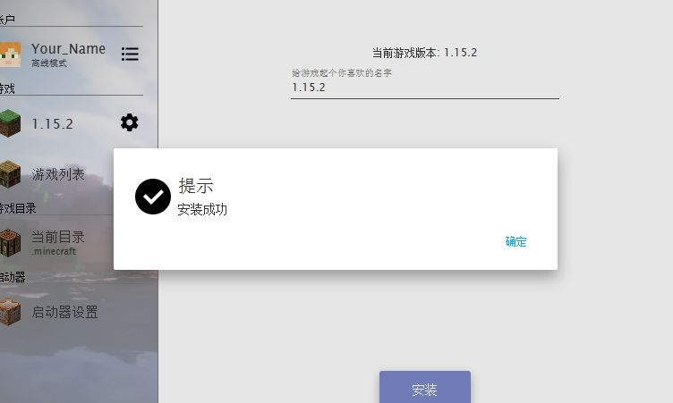

安装完成，点击“确定”。

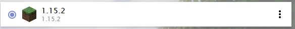

安装的游戏版本已被自动选中。

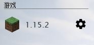

点击左侧的游戏版本

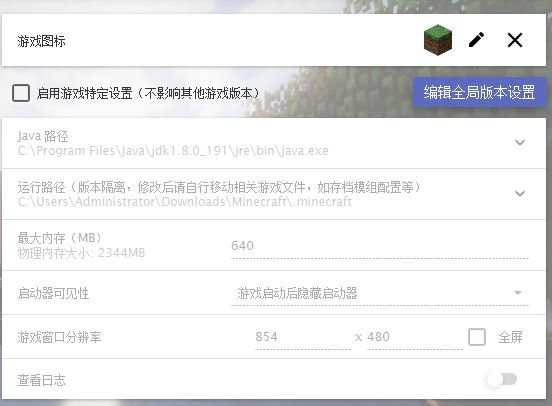

确定最大内存设置正常，若不清楚请保留默认设置。若需修改，点击编辑全局版本设置。

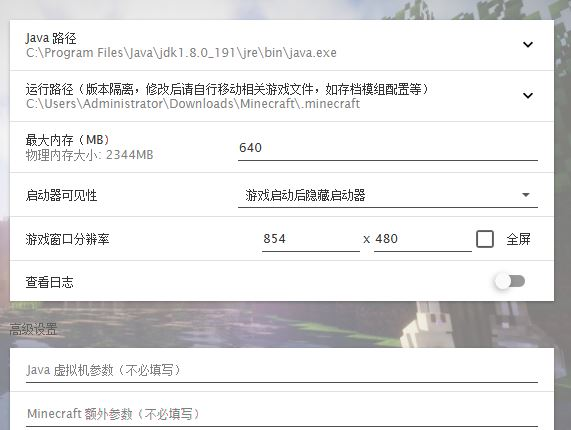

修改完成后点击左箭头返回。

点击如图所示按钮回到主界面。

点击启动游戏。

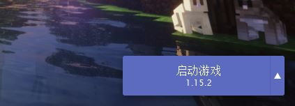

等待文件校验和游戏启动。

等待游戏主界面出现。

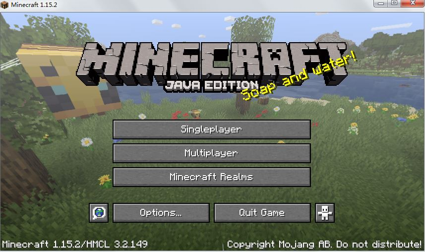

点击如图所示按钮设置语言。

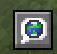

在出现的界面中选择中文。点击"Done"（或"OK"或"Yes"或类似文字）按钮，等待语言设置生效。

别忘了在游戏设置中酌情修改游戏画质。

下次启动游戏只需要打开启动器并点击启动游戏按钮。

您现在可以开始游戏了。
