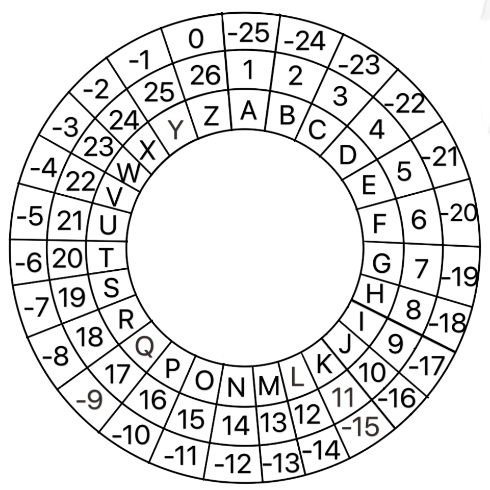

# 在校园中安全传递信息的方法改进版

**_Copyright Melancholie（2020.6.26）_**

**SUMMARY：unknown 加密方案改进版，达到安全、方便、可行性高的目的。**

## 加密方案

### 一. 针对英文信息的加密方案

双方规定统一英文密钥，用密钥与明文字母一一对应，将明文字母排号与对应密钥字母排号相加得密文字母排号。

为便于与中文信息区分，在信息首部加“^”

如有大数字相加情况，如“X-y”对应，则将二者排号相加之后减去 26 得密文字母。

> 例：Alex 与 Branda 约定今日密钥为 CODE，要加密的信息为“hello”，那么对应关系为 C-h O-e D-l E-l C-o 。加密方法为 C+h=3+8=11=K，以此类推，最终密文为^KTMNR。X-y 对应方式情况下，为 24+25-26=23=W。

### 二.针对中文信息的加密方案

同样，双方需规定统一的英文密钥。要将中文化成汉语拼音，然后与英文信息加密方法类似。

为与英文信息区分，在密文前加“#”。

存在同音不同字的情况。但密文解码者可以轻易猜出。如阅读有困难，可在字后添上数字表示音调。

> 例：Alex 与 Branda 约定今日密钥为 CODE，要加密的信息为“你好”，那么对应关系应为：C-n O-i D-h E-a C-o。那么密文为#QXLFR。如有需要者，可以将密文标为#QX3LFR3。

### 三. 对于符号的加密方案

符号可以不进行加密，不影响密文的安全性。

### 四. 对于数字的加密方案

数字加密采用对称加密方案。

0-9 十个数字按顺序排列，对称线在 4、5 中间分为两部分，将明文数字替换为对称的数字。

0 1 2 3 4 ｜ 5 6 7 8 9

> 例：0 替换为 9，3 替换成 6，以此类推。

### 五. 破解方法

知道密钥即可破解，如不能得到密钥，破解可能性极低，但可以硬解或猜出密钥。最常用的字母频率分布法失效。

### 六. 信息传送

可直接或在指定地点传送信息，也可交付给不知密钥的第三者传送。考虑到“校园内信息传输”的前提，可以假定第三者有很小的概率会将信息扣下，在不知密钥的情况下破解的可能性近乎为零。如是专业机密信息传输，可以分别交给两个或以上的不知密钥的可信度较高的人，尽可能提高信息安全送达的可能性。

### 七. 出于保险起见的二层加密方案

如有需要，可以在已进行加密的前提下进一步加密。

进一步加密的方法可以采用凯撒加密法、猪圈密码、普雷费尔密码、ADFGVX 密码、RSA 加密等。具体不在此一一说明。建议采用凯撒加密法，因为这种加密法仅记住移位数即可，不需要字母表等，减少表达密钥的机会，从而增加信息安全性。同时凯撒加密法不适合第一层加密，原因是此种加密方法可以使用字母频率分布法破解，而第二层加密不涉及这个问题。

但在“校园内传递信息”的前提下，在大多数情况下第二层加密方案有些冗余。

### 八. 注意事项

（1）英文密钥最好是简短的单词。

（2）尽可能不表达密钥。

（3）此方案不适合对抗超级计算机。

（4）密钥选择需谨慎，最好与自身及对方关系小或根本无关，以降低敌方猜出密钥的可能性。

考虑到“校园内传递信息”的前提，此条可以忽略。

（5）密文最好使用水溶性笔书写，解密后，如有必要，可采用燃尽、水洗、撕毁、食用等方法。

考虑到“校园内传递信息”的前提，此条可以忽略。

（6）信息传输过程中，可采用分支法，提升信息送达的概率，但在此基础上，保证与信息接触的第三方越少越好，以确保信息安全性。

**附：便捷字母表**

使用方式：从内到外第二层为字母正常排序，最外层使用方法为：出现排号大的密钥以及明文时，可以采用最外层负数加减以及正负数交替使用得密码文。

> 例：密钥与明文对应关系为“X-y”时，可以通过 X+y=（-2）+（-1）=-3=W 的算法快速求得。
>
> W-c 对应关系中，可以通过（-3）+3=0=Z 求得。
>
> V-e 对应关系中，可以通过（-4）+5=1=A 快速求得。

此表可有效提高编码以及解码的速度，请应用得当。
