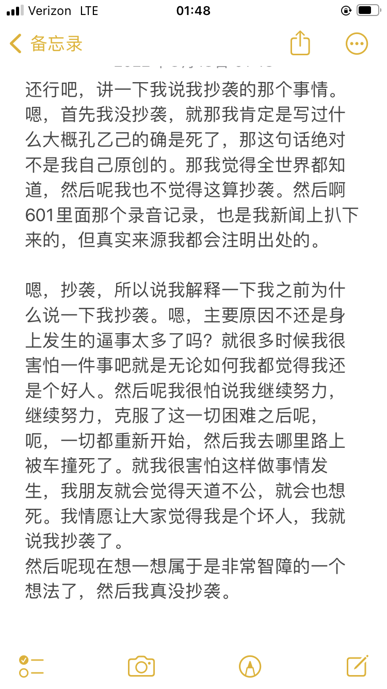

## 站务回应

我们在 2026-02-17 通过评论区获悉，[有关站点工作人员](http://www.wikidot.com/user:info/w-asriel)已在 4 Nov 2025, 15:09 作出[回应](http://05command-cn.wikidot.com/forum/t-15088930/hannah-ai)（[Archive](https://web.archive.org/web/20260219110404/http://05command-cn.wikidot.com/forum/t-15088930/hannah-ai)）。

考虑到我们无法代表任何当事人，也没有被委托处理相关事宜，因此不会在这里对站务回应做出任何评价。（就我个人而言，为这位站务的责任精神点个赞）

我们仍然接受有关此事件的任何评论或通讯，但无法保证快速更新信息。您也可将您的抗辩或质疑意见发送给[有关站点工作人员](http://www.wikidot.com/user:info/w-asriel)。

在下面摘抄完整的站务回应以供参考：

---

用户[](http://www.wikidot.com/user:info/hannah-ai)[Hannah_AI](http://www.wikidot.com/user:info/hannah-ai)发布作品[分手](https://scpper.com/page/1304863430)（现已自删，目前仍在其[沙盒中](http://scpsandboxcn.wikidot.com/confucious)，[新 SCPPer](https://scpper.mer.run/page/1304863430)链接）抄袭《[学习康德好榜样](https://zhuanlan.zhihu.com/p/363976654)》（作者虎头，《当代杂志》 2006 年第 6 期），故做出封禁 1 个月之处分。
[调色盘](https://scpsandboxcn.wikidot.com/local--files/collab:records/%E8%B0%83%E8%89%B2%E7%9B%98_%E5%88%86%E6%89%8B.pdf)

2025.11.03 补充说明：
**Q：**自删的作品也会被追溯处分吗？沙盒的文章也会被处分吗？

并不绝对。这么做的依据有下。
1\. 沙盒站的规则提及：“工作人员保留删除违规沙盒页和材料的权利。如果在沙盒站违反了主网站的规则，可能会采取纪律处分。” （见：[沙盒站首页](https://scpsandboxcn.wikidot.com/)）2. 我们了解沙盒站的内容往往是作者的创作中草稿，有时候包括参考材料等，并不一定严格遵循包括 CC 协议等在内的规则。实际判定上，则取决于其是否被置于**发布和展示状态**。
3\. 具体到《分手》例，其满足了以下的条件：

- 已经被在主网站（SCP-CN 维基）发布过。
- 仍被原样展示于沙盒。
- 作者在其位于主网站的[作者页](https://scp-wiki-cn.wikidot.com/hannah-s-personnel-file)给出了以下内容：“我写了一些外围和一篇 scp，我把他们放在沙盒里了，看我编辑记录就有了。”
    - 这实际上将沙盒作为了作品展示页面之一，而且给出了具体的访问路径。
    - 作者也同时将其他发布或未发布作品展示于沙盒。

4\. 因此我们认为《分手》实质上仍然是发布状态的作品，并受到网站规章的管辖。

作为参考的是，同作者的作品[地球二 中心页](https://scpper.mer.run/page/53929780)（约 2017 年 9 月发布，约 2019 年 12 月自行删除），在查重中发现全文复制自[suixinsuiyuan 圣斗士星矢同人《雅典学派》](https://www.zhihu.com/search?type=content&q=%E5%90%8A%E7%AC%BC%E3%80%81%E6%9C%A8%E6%9E%B7%E3%80%81%E9%92%A2%E9%A1%B9%E5%9C%88%E3%80%81%E9%93%81%E5%90%8A%E7%B4%A2%E3%80%81%E5%BC%80%E8%8A%B1%E6%A2%A8%E3%80%81%E5%8F%A3%E6%9E%B7%E3%80%81%E6%9C%A8%E9%A9%AC%E3%80%81%E9%93%81%E5%A4%84%E5%A5%B3)且未标出处。因页面自删且并未被作者主动展示或留存，因此未做出追溯性处分。

此外，草稿区偶有作者分享的创作中草稿涉及了大段不加出处声明的、对非 CC 材料的复制粘贴。若这些草稿被原样发布，其将被判定抄袭，但因草稿被视作未完成/未发布状态，因此站务从未做出任何处置。

\[其他疑问和抗辩意见\]

这些实际上并不影响判定或者与规则无关，我们认为以上内容已经足够做出抄袭认定。但因抗辩方提出/存在提问，我在此也做出一一详细的正面回复。

**Q：**这篇文章涉及复制的文本量是 150/3000 字。这个程度是否该视为致敬？是否有抄袭的判例依据？

《[反抄袭政策](https://scp-wiki-cn.wikidot.com/anti-plagiarism-policy)》对致敬的规定是：

> 仅限于个别词语、句子的极少量引用、改编属于用典/致敬/彩蛋，这些不必予以注明。

“致敬”在常识判断中也往往来自知名台词或者句子。所复制部分并非引自康德原文（引用的康德原文部分并未被标记），而是一名杂志作者对康德的个人解读，也不属于名台词。
150/3000 的不署名复制粘贴在本站的处置标准中超出了可接受范围。
比例相近的判例有《星海遗孤》（已删除，公告于 2019 年 4 月 20 日，[SCPPer 备份](https://scpper.mer.run/page/69801977)，[通告帖链接](https://scp-wiki-cn.wikidot.com/forum/t-11228898/freedom-koo#post-4224390)，[调色盘](http://scpsandboxcn.wikidot.com/local--files/collab:turnitin/SCP-CN-231.pdf)链接）

**Q：**这篇文章似乎只在主网站存在了两个小时/已经是几年前的了，而且只有十多分。为什么也要处分？

1. 《反抄袭政策》仅关注抄袭现象，文章的发布时间和分数与之并无关系。有大量判例是在文章发布不久后就立刻锁定并处分，其从发布到处分，时间远远小于 2 小时，有不少还是负分状态。
2. 如第一个 Q&A 所述，站务认为《分手》**被实际置于持续性的发布展示状态**，亦即其截止到被查实时仍处于该状态。
   3\. 这篇文章在主网站存在了**不止 2 小时**。

- 该观点的“文章存在了 2 小时”是基于 SCPPER 的 Last Update 时间被记录为 2020-09-17 06:14，而发布时间被记录为 2020-09-17 04:18。但这可能是对 SCPPER 机制的误解导致的。
- SCPPER 基于爬虫运行，每隔一段时间统一抓取一次全站页面的元数据。“Last Update”为统一抓取的时间戳，而页面详情中的版本记录时间戳则直接来自于页面元数据的版本记录，与 SCPPER 更新频率无关。
    - 换句话说其“Last Update 时间”仅代表其最后一次在网站上“看”到该页面的时间，而非页面的实际删除时间。页面仍在 SCPPER 抓取后持续存在一段时间。
    - 一个现存的例子恰恰就是下一篇文章《大纲》，其 SCPPER 记录的 Last Update 时间为 2022-09-01 16:20，但实际删除时间（亦即 05c 公告时间附近）是 2022-09-02 17:35，是一天多之后。
    - 也可以登录 SCPPER 主页，切到“Chinese Branch”并留意整个分支 Last Update 时间戳，然后随机检查几个仍存在的页面，可验证这些时间戳都是一样的。代表 SCPPER 上一次统一爬取的时间。
    - 在我的记忆中，旧版的 SCPPER 对中分更新时间是一周一次，后改为一天一次。Last update 2020-09-17 06:14 代表该 SCPPER 数据最后一次被更新的时间，而 SCPPER 在下一次更新中并没有看到它。实际删除时间应大于 2 小时，小于 7 天。

4\. 抄袭是无限追溯制，在《反抄袭政策》201 9年第一次制定和应用于[](http://www.wikidot.com/user:info/freedom-koo)[Freedom Koo](http://www.wikidot.com/user:info/freedom-koo)案（下称自由）时，便追溯性地应用于了其所有过往作品。这是因为作者本有机会随时修正或删除他们的抄袭作品，但他们选择了继续展示抄袭材料。同理，《地球二 中心页》也因实际自删而并未被追究。
5\. 同上条判例，也不会因该作者是前站务、威望高或者曾有贡献而免除处分。

---

该用户发布作品[中国██大学 2018 年春季学期异常心理学教学大纲](https://scpper.com/page/64966487)（[原链接](https://scp-wiki-cn.wikidot.com/hannah-s-syllabus)）的折叠外部分几乎全文照搬"Fall20 Abnormal Psychology"（原文为英语，下称原教学大纲）。

由于
1\. 网络上公开的各学校《异常心理学》课程的教学大纲各不相同。搜索文中某段，能且仅能找到原教学大纲，且文本内容几乎完全一致。其他段落则无法直接搜索到重合内容。（该段为原教学大纲唯一能被搜索引擎找到的内容；完整大纲则能在[CourseHero 学习资料网站](https://www.coursehero.com/)查看。）
2\. 不同学校教学大纲对于作业要求、作业内容、分数要求、教学内容和计划均各不相同，而文中的相应内容和原教学大纲几乎完全一致。
3\. 尽管其所授的是同一门课程，不同学校教学大纲的课程目标、课程描述、论文题目不尽相同，所使用的介绍语、措辞、顺序，所讲的内容等等均有很大差异，而文中相应文本和原教学大纲几乎完全一致。

故而认为本文的大量内容并非原创，因此认定为抄袭，并删除文章。由于此为该用户的第二篇抄袭作品，故做出永久封禁之处分。

[调色盘](https://scpsandboxcn.wikidot.com/local--files/collab:records/%E8%B0%83%E8%89%B2%E7%9B%98_%E5%BC%82%E5%B8%B8%E5%BF%83%E7%90%86%E5%AD%A6.pdf) （原文为英语，经谷歌翻译，故语序、词汇选择可能与中文文章有所出入。）
包括本文在内的共计六份《异常心理学》教学大纲的[文本比对](https://scpsandboxcn.wikidot.com/local--files/collab:records/%E5%A4%9A%E4%BB%BD%E6%95%99%E5%AD%A6%E5%A4%A7%E7%BA%B2%E7%9A%84%E6%96%87%E6%9C%AC%E6%AF%94%E5%AF%B9.pdf)，以说明其重合部分并非“异常心理学课程教学大纲”所共有的内容、公用标准或者公有文本。

由于涉及校名，人名等信息，调色盘中的原文链接已暂做删减处理，并隐去截图中的所有相关信息。出于公开透明之原则，若当事人要求，可公开完整原文链接和查重过程。

2025.11.03 更新

\[其他疑问和抗辩意见\]

同理，这些实际上并不影响判定或者与规则无关，仅仅是对此做出正面回复以期解答疑问。

**Q：**用户的教学大纲上传于 2018 年，而原大纲被上传于 2020 年。这样的证据是否存在瑕疵？

站务工作显然并非法庭工作，实际处置违规也以事实为依据。我们认为证据已足够证实抄袭事实存在，因此可以作为认定标准。除非作者能够证明自己是该学校后续 2020 教学大纲的作者，否则抄袭事实几乎无法推翻。

- 作为补强，该校官网同样有完全一致的该教学大纲的第一段内容（具体路径为：官网搜索心理学 Program 并在完整课程列表中找到该课程号）。
- 当时出于隐私考虑，以及认为原始课件本身证据已经足够，因此并未公布第二条证据。

**Q：**用户的前半部分虽然完全复制，但并非文章核心思想。用户的后半部分仅仅使用了原文的结构和骨架，但核心思想不同。这不应构成抄袭。

在我们的定义中，这恰恰证明了《大纲》的过半内容均为照搬，属于极大幅度的抄袭。

---

[该用户的另一篇抄袭作品](http://scp-wiki-cn.wikidot.com/forum/t-15176050/)。

文档《为何而站》（原地址：why-we-fight-how-we-fight）大量照搬小说《兽血沸腾》而未声明出处。[调色盘见此](https://scpsandboxcn.wikidot.com/local--files/collab:records/%E8%B0%83%E8%89%B2%E7%9B%98_%E4%B8%BA%E4%BD%95%E8%80%8C%E7%AB%99.pdf)。
原文归档[链接见此](https://scp-wiki-cn.wikidot.com/deleted:why-we-fight-how-we-fight)，其内容和原始讨论区仍可访问。作者[](http://www.wikidot.com/user:info/hannah-ai)[Hannah_AI](http://www.wikidot.com/user:info/hannah-ai)于讨论区做出的声明提及：

> 又算合作又不能彻底算合作的一篇？
>
> 剧情设置和大部分由我完成，Tictoc 贡献了第二段绿字，“Hannah 拿到箱子”到“Hannah，跑”和最后的的“下雨了”到神父说自己的名字的那部分。

根据比对，证实所有抄袭部分均来自于[](http://www.wikidot.com/user:info/hannah-ai)[Hannah_AI](http://www.wikidot.com/user:info/hannah-ai)所认领部分。**另一用户所贡献内容中并无抄袭内容。**

2025.11.03 补充：

\[其他疑问\]

**Q：**原始公告提及“不关心一切合著”原则。这是否意味着页面发布者替所有其他贡献者承担违规内容的责任？

具体到抄袭案例，若清晰证据或分工信息能证实某人在文中大幅照搬文本并“假装是自己所作”，则构成本站对抄袭的定义。这与文章的合著情况或署名情况无关，**无论其是否是页面发布者，或者是否被署名列为合著作者。**即使一个人仅仅为文章提供了一段涉嫌抄袭的文本而没有署名，只要证据确凿，仍然可能被追责抄袭。在难以溯源、存在争议或责任模糊的情形下，原则上由页面发布者承担违规内容的责任，以杜绝任何可能的滥用。

具体到本案，分工信息由当事人发布、无争议且证明当事人完成了全部涉及抄袭的部分，此为判定抄袭的依据。该用户同时也是页面发布者，且该页面并无“合著”标签，但这与责任认定无关。

原始公告中所说的：

> 另，由于本文档的原作者声称本文档存在合著行为，而站务在处理文档时原则上不因此类行为而有任何影响（即“不关心一切合著”原则） 综上，所有相关合著者，若对原文档的个人著作部分有其他主张，需重新撰写文档后另行发布。

其主要是针对另一贡献者对著作权主张的角度而言的，但并不暗示页面发布者无条件替代其他贡献者承担违规责任。

---

最后就总体疑问（包括对我本人的）做出回复。

**Q：**抄袭的处理流程到底是什么样的？为什么利益冲突方没有做出回避？

抄袭是很严重的指控。自《反抄袭政策》于 2019 年制定至今，抄袭（和绝大部分决定）都需要多名站务联署方可判定。在大多数案例中，往往由我（[](http://www.wikidot.com/user:info/w-asriel)[W Asriel](http://www.wikidot.com/user:info/w-asriel)）进行调查、举证，而具体处理和认定意见由站务组商讨达成一致，再由具备权限的 Admin 执行封禁（在 2024 年之前我并不具备该权限），最后再由其中一人（往往也是我）进行通告。

由于 SCP-CN 是个小圈子，所以站务处理案件时并无制度性的回避政策存在。本人也处理了绝大多数的抄袭或其他类型的违规，有其中不少同时也是相识的社群成员甚至有过摩擦的知名人物。举例而言，我曾是我处理过的其中一起 doxxing 事件的直接受害者，但也并未启动回避机制。

具体到本案，鉴于[](http://www.wikidot.com/user:info/hannah-ai)[Hannah_AI](http://www.wikidot.com/user:info/hannah-ai)是前站务和社群知名人物，站务组内几乎所有执行人员都要么与之共事过，要么与之有过较多人际交集，几乎不可能找出完全无利益冲突的成员。此外，鉴于抄袭证据属于白纸黑字，也从规章制定之初就被声明过属于零容忍的社群底线，此案本应最没有争议。我们当时并不认为有回避必要，也并不认为有完全回避的可能性，因此认为以常规流程处置便可。

在前两篇被查实和用户封禁之后，我本人因各种原因退出后续处理，并由[](http://www.wikidot.com/user:info/areyoucrazytom)[Areyoucrazytom](http://www.wikidot.com/user:info/areyoucrazytom)接手第三篇的处置。此事件也令我深刻认识到，网站事务上或应当设立更系统的回避机制，以保护案件本身、当事人以及相关站务。

**Q：**此案是否从快从严了？

抄袭案的处理都非常快，从查实到封禁通告基本都在几个小时之内，因为其涉及社群底线。此案属于正常速度。

《[反抄袭政策](https://scp-wiki-cn.wikidot.com/anti-plagiarism-policy)》中提到的对于批量抄袭之作者的处分是：

> 对经证实累计有多于一篇作品抄袭的作者，删除涉及抄袭的全部作品，对其行为予以全站公告，**移除其作者个人页面、作者页连接。对作者本人予以永封处分。**
> 若经证实有三篇以上作品存在抄袭的，视为该作者存在大批量抄袭行为，对其现存**所有作品添加“原创性待查”标签，移至 Reviewing 分类**，并对此处置予以全站公告。若有作品占用 CN 原创主列表编号，它将被从主列表腾退。……某篇作品被从主列表腾退，而它先前的编号在这期间有了新的投稿，那么该作品在回到主列表时必须重新选择编号。

[](http://www.wikidot.com/user:info/hannah-ai)[Hannah_AI](http://www.wikidot.com/user:info/hannah-ai)的永久封禁在此应用了同等标准。
其实际查实抄袭篇数为三篇，但我们并未移除作者页链接，也没有腾退其所有篇目并移到其他分类，而是在不做任何编辑的情况下原位调查，使得这些篇目在调查前后可以完全不受干扰地被展示。**已经属于从轻处理**。

该作者也仍然持有沙盒站的编辑资格并继续发布内容。

在检查中我们发现用户有其他多篇作品也存在不当引用现象，但并未进一步追究。这些内容本应进行公示。现一并公布如下：

\[展开完整调查结果\]

[彷徨](http://scp-wiki-cn.wikidot.com/panghuang)

> 从《▇▇》开始对封建礼教与旧传统的批判，与复古派的论争，一直延续到《▇▇▇▇▇▇▇》对\[数据删除\]政府的法西斯专政的抗议。“不克厥敌，战则不止”。学▇救不了▇▇▇，那么在基金会工作能吗？

来自钱理群《走进当代的鲁迅》，1999。相同选段可参考此[网页](https://www.arteducation.com.tw/authorv_88de4e0f42ea.html)

> 從《熱風》開始的對封建禮教、舊傳統的批判，與復古派的論爭，一直延續到《且介亭雜文末編》對國民黨政府的法西斯專政的抗議，對中國共產黨內的“左傾”路線的反擊。魯迅雜文所顯示的這種“不克厥敵，戰則不止”的不屈精神

由于该段内容出现在不少鲁迅相关文献，且文本量少，故不认为存在主观恶意，仅认为属于极少量的不当引用。

[SCP-CN-106](http://scp-wiki-cn.wikidot.com/scp-cn-106)

> 李██： 但是小姑娘，有些时候就算是知道说真话的代价是什么，还是要有人去做。能独立地表达自己的观点，却不傲慢，对政治表示服从，却不卑躬屈膝。能积极的参与国家的政策，看到弱者知道同情，看到邪恶知道愤怒，我认为他才算是一个合格的公民。这就是为什么很多人，包括我推测的你所在的组织，还是在持续不断地明知不可为而为之的理由。
>
> Hannah 博士： 那么，您想要一个什么样的世界。
>
> 李██： 我想要宪法赋予我的那个世界。

该段文本照搬自柴静的[《看见》第八章](https://www.99csw.com/book/3469/117783.htm)。作者在评论区称灵感来源为柴静《看见》，并未提及文本引用之事。
站务认为其标注了出处和原作，不认为其存在“假装自己创作”之主观恶意，加之柴静原文相对出名，因此不认为其构成抄袭，仅属于不当引用。

[地球二](https://scpper.com/page/53929780)
全文复制[《雅典学派》suixinsuiyuan 圣斗士星矢同人](https://www.zhihu.com/search?type=content&q=%E5%90%8A%E7%AC%BC%E3%80%81%E6%9C%A8%E6%9E%B7%E3%80%81%E9%92%A2%E9%A1%B9%E5%9C%88%E3%80%81%E9%93%81%E5%90%8A%E7%B4%A2%E3%80%81%E5%BC%80%E8%8A%B1%E6%A2%A8%E3%80%81%E5%8F%A3%E6%9E%B7%E3%80%81%E6%9C%A8%E9%A9%AC%E3%80%81%E9%93%81%E5%A4%84%E5%A5%B3)且未标出处。
但因作者自删，被认为无需追究。

此外，还有一篇现存文章的旧版本文本照搬一篇非 CC 小说，作者在作者帖宣称“使用该小说的情节”，但并未提及引用。在两年后，作者自行修改了照搬的部分并重新创作，并在作者帖声明了引用之事。这也被认为属于合理的补救措施，而无需追究。

\[展开完整调查结果结束\]

综上，尽管上述引用内容已尽可能从轻认定，但我们认为该作者的抄袭行为表现出了系统性和连续性，而非勉强满足标准即被“从快从严”。

“2 篇即永封”之标准是依照 2018 年的[](http://www.wikidot.com/user:info/lee-knight)[Lee Knight](http://www.wikidot.com/user:info/lee-knight)案作为判例依据而制定，[链接见此](http://05command-cn.wikidot.com/forum/t-6798398/lee-knight)。该案恰恰是[](http://www.wikidot.com/user:info/hannah-ai)[Hannah_AI](http://www.wikidot.com/user:info/hannah-ai)本人所主理。我们尊重其为社区原创性做出的努力，并希望秉持同样的标准。

**Q：**为什么当时信息不透明？为什么现在又写那么详细？

截止到今日更新前，原版通告的内容量和透明性与其他抄袭案的体量是相当的，我们当时认为信息和证据均已足够，无需额外说明。所有比对内容均按照常规流程在 05Command 进行了公示。

2019 年自由案完整进行了全部的《反抄袭政策》中的查重和公示流程，先后在主网站（SCP-CN 维基）发布了三个全站[通](https://scp-wiki-cn.wikidot.com/forum/t-11116231/)[告](https://scp-wiki-cn.wikidot.com/forum/t-11178250/)[帖](https://scp-wiki-cn.wikidot.com/forum/t-11228898/freedom-koo#post-4224390)，并引起了巨大的社群动荡与群情激愤，对作者本人的名誉影响是毁灭性的，在社群也造成了长久的负面影响。

具体到本案，我们选择了低调处理，在主网站的通告帖也仅给出文章内容比对而不明确写出作者 ID。这并非不愿意公开透明，而仅仅是出于人道主义之考虑。

后续逐渐发现，此事件存在巨大的信息差和一些或可能造成误导的声音，导致了不少疑问，直至今年仍持续存在一些疑问和非正式的抗辩意见。我退出后续处理后也并未过问过此案后续，原本是出于或许确实应当回避的考虑，而非不愿面对质疑。对于部分疑问和抗辩意见，由于其和规则本身无关/没有通过正式渠道提交，原本也被认为无回复必要。但事实证明，这并非消除疑问和保障透明性的方式。

如今就此事的讨论和关注已基本平息，因此在此补上详细的判定依据和细节，并对一些疑问、质询和抗辩意见做出统一回复，以展示我本人愿意对此案负责任到底的态度。

迄今为止，并无颠覆抄袭事实的抗辩意见被提出，因此仍维持原本认定不变。

后续仍接受各方抗辩或质疑意见，但请通过正式渠道提交。

---

## 引子

本站曾经发布了有关此事的讨论（[有关 SCP 基金会中文社区部分管理行为的不完全且可能有偏见的讨论]()），但是当时为了避免给任何人造成伤害（我们认为，涉事人员或多或少地无法为自己负全责），它故意被写得非常混乱和模糊。

让我们松了一口气的是，经过了两年，似乎没有任何人因为这篇文章受到伤害——它甚至根本没有点击量。我们也没有收到任何有关此事的通讯，这使我们相信，也许没人在乎这件事。

所以，鉴于上述判断，下面是关于此争议的核心问题的明确总结，以备未来检索需要：

## 第一部分

这是整个抄袭处罚的开始：

> 用户 Hannah_AI 发布作品[分手](https://scpper.com/page/1304863430)（现已自删，目前仍在其[沙盒中](https://scpsandboxcn.wikidot.com/confucious)）抄袭《[学习康德好榜样](https://zhuanlan.zhihu.com/p/363976654)》（作者虎头，《当代杂志》 2006 年第 6 期），故做出封禁 1 个月之处分。
>
> [W Asriel](https://www.wikidot.com/user:info/w-asriel) at 15 Aug 2022, 14:32 on [05command-cn](http://05command-cn.wikidot.com/forum/t-15088930/hannah-ai)

《分手》里的部分文段（约 150 字/3000 字）对《学习康德好榜样》的[部分段落打散并复制](https://scpsandboxcn.wdfiles.com/local--files/collab%3Arecords/%E8%B0%83%E8%89%B2%E7%9B%98_%E5%88%86%E6%89%8B.pdf)。这或许可以被称作“抄袭”，主要的争议不在这里。

根据[ScpperDB 的爬虫记录](https://scpper.com/page/1304863430)，《分手》于`2020-09-17 04:18`发布，最后一次编辑在`2020-09-17 05:07`，有记录的最后更新时间是`2020-09-17 06:14`。检查 ScpperDB 的其他页面，可以猜测它的爬虫逻辑是尽可能快地获得更改。合理猜测，《分手》的删除时间就在`2020-09-17`当日，很可能就在`06:14`，最长不超过一天。

**所以，根据我们的推测，这似乎是一篇存在了大约 2 个小时，有 15 个人投票，然后被删除的文章。在它被删除大约两年后，它被发现于作者的沙盒页，然后被处以了抄袭惩罚。**

如果这个推测有任何错误，请联系我们，我们很愿意了解关于此决定的任何细节。

如果推测没错的话，这个过程看起来有些荒谬，甚至比“抄袭”本身更引人注意。

## 第二部分

接下来：

> 该用户发布作品[中国██大学 2018 年春季学期异常心理学教学大纲](https://scpper.com/page/64966487)的折叠外部分几乎全文照搬"Fall20 Abnormal Psychology"（原文为英语，下称原教学大纲）。
>
> 由于
>
> 1. 网络上公开的各学校《异常心理学》课程的教学大纲各不相同。搜索文中某段，能且仅能找到原教学大纲，且文本内容几乎完全一致。其他段落则无法直接搜索到重合内容。（该段为原教学大纲唯一能被搜索引擎找到的内容；完整大纲则能在 [CourseHero 学习资料网站](https://www.coursehero.com/file/75559340/Psy346A-Fall20-Abnormal-Psychology-Handojo-Vpdf/)查看。）
> 2. 不同学校教学大纲对于作业要求、作业内容、分数要求、教学内容和计划均各不相同，而文中的相应内容和原教学大纲几乎完全一致。
> 3. 尽管其所授的是同一门课程，不同学校教学大纲的课程目标、课程描述、论文题目不尽相同，所使用的介绍语、措辞、顺序，所讲的内容等等均有很大差异，而文中相应文本和原教学大纲几乎完全一致。
>
> 故而认为本文的大量内容并非原创，因此认定为抄袭，并删除文章。由于此为该用户的第二篇抄袭作品，故做出永久封禁之处分。
>
> [W Asriel](https://www.wikidot.com/user:info/w-asriel) at 2 Sep 2022, 04:35 on [05command-cn](http://05command-cn.wikidot.com/forum/t-15088930/hannah-ai)

这里提供的 ScpperDB 链接证明了，任何对页面的更改几乎会被立即记录。记录中的最后更新时间`2022-09-01 16:20`与站务删除文章的时间（`2 Sep 2022, 04:35`前）非常相近。这证实了我们对《分手》删除时间的猜测。

在原文中，[约 6000 字符的一半是对“原教学大纲”的翻译](https://scpsandboxcn.wikidot.com/local--files/collab:records/%E8%B0%83%E8%89%B2%E7%9B%98_%E5%BC%82%E5%B8%B8%E5%BF%83%E7%90%86%E5%AD%A6.pdf)（主要包含课程介绍、课程内容关键词和评分），另一半是 SCP 基金会风格的改写。**当主要内容是原创，框架和非主要内容是翻译/“抄袭”时，这能否被明确判定为抄袭？**

**其次，当我们检查 SCP 基金会中文站其他抄袭处罚记录时，我们没能找到第二份如此细致的惩罚。**

还有一个不重要但有趣的细节：被引用的 CourseHero 文档上传于 [12/7/2020](https://www.coursehero.com/file/75559340/Psy346A-Fall20-Abnormal-Psychology-Handojo-Vpdf/)，而《中国██大学 2018 年春季学期异常心理学教学大纲》发布于 [2018-02-06 02:10](https://scpper.com/page/64966487)。（但这不意味着 2018 年发布的文章抄袭了 2020 年的教学大纲，因为无法否认此教学大纲可能始终没有更新过且在 2020 前就已存在，只是不存在于公开资源中）

## 作者的回应

疑似 Hannah_AI 的[哔哩哔哩账号](https://space.bilibili.com/3607104/dynamic)在`2022年08月18日 16:50`的[回应](https://t.bilibili.com/695673947661795334)如下：



很奇怪，和`15 Aug 2022`的公告完全不搭边。在某种意义上也算合理，因为当时《分手》并不存在于 SCP 基金会中文站上。

我在下面复制了 W Asriel 对此回应的评论：

> [http://05command-cn.wikidot.com/forum/t-15088930/hannah-ai](http://05command-cn.wikidot.com/forum/t-15088930/hannah-ai)
>
> 为避免困惑，这是调色盘公示。截图里提到的孔乙己和 601 确实没抄，被证实抄袭的是其他文章。
>
> _说真的发表这种回应完全就是利用不看 05c 的人的信息差吧。真可耻。自由当初好歹还就被锤的文章道歉了。_
>
> [W Asriel](http://www.wikidot.com/user:info/w-asriel) at 6 Jan 2023, 04:54 on [Hannah 博士的人事档案 讨论页](https://scp-wiki-cn.wikidot.com/forum/t-2310237/hannah-s-personnel-file)（[跳过登录查看 RSS 版本](https://scp-wiki-cn.wikidot.com/feed/forum/t-2310237.xml)）（这种忽略了上下文和发布时间的人身攻击完全不是专业的管理行为）

以及在`14 Jan 2023`，Hannah_AI 的[沙盒页](https://scpsandboxcn.wikidot.com/confucious)：

> 我真的受不了，我对不起 WA 银冰 infas 可是我做不到不去想他们。
>
> 我爱你们。自杀不是你们的错。
>
> 我没抄袭。

看不懂，不过可以在[Hannah 博士的人事档案](https://scp-wiki-cn.wikidot.com/hannah-s-personnel-file)的版本 216（`11 Nov 2021`）找到一些记录：

> 20211110 更新
>
> 我真的不知道自己该怎么办了，我已经很努力了啊，一直在学习一直在工作，一直在分享日常，至今为止再没有想过结束自己的生命，然后呢？
>
> 他妈的傻逼在我怀念我死去朋友的时候跑过来说“人家根本没有把你当做朋友哦人家和你最讨厌的人是恋人呢”，然后继续再在评论区内涵我？？？？去你妈的吧

以及：

> 嗨，好久不见了。今天觉得或许还是有必要更新一下人事。
>
> 一年多没发原创和翻译了，但其实这和之前的纠纷没有多大关系。主要还是因为我升学了，任务的难度，数量都高了很多。我自己实在是疲于应付这些，所以就咕了起来。
>
> 但是我也不算一点都没写，我写了一些外围和一篇 scp，我把他们放在沙盒里了，看我编辑记录就有了。但是我总觉得故事的节奏掌握的不好，剧情张力不太强什么的。所以一直放着，还没想好怎么改。我还为一个 b 站 up 主的 scp 视频配了音。这么看来还是做了一点和 scp 有关的事的。
>
> 希望大家都能好好的，如果用评论或者私信的方式给我一些建议就更好了。
>
> 最后，我还是要郑重地就 2018 年九月的那件事向所有人道歉。没能缓解矛盾导致事情越闹越大是我的问题。我真的，真的感觉很对不起。如果你对我感到失望，那真的太抱歉了，我对那时的自己也很失望。如果你对我犯的错误感到愤怒，我错了就是错了，躺平任嘲。如果你对我感到惋惜，那大可不必。我是一个我身边所有人都公认运气非常差的人，新年祝福收到的有 80%都是“希望你明年运气好起来”。但是，我坚定地认为，因为去年的纷争导致的和矛盾中的对方的不再往来。是一件我这三年来的人生中发生的最好的事，我真心，真心地为了自己不再需要被敲骨吸髓感到高兴。
>
> 写到这里就快结束了，谢谢看完的你，也谢谢一直关注我的你。

## 回看

如果检查 Wayback Machine，可以发现此哔哩哔哩账号在`1 Feb 2023`仍保留着[《分手》](https://web.archive.org/web/20230201144957/https://www.bilibili.com/read/cv7634240)（在`2020-09-17 11:54`发布在哔哩哔哩）。

这引发了一个阴谋论，`15 Aug 2022, 14:32`的处罚是否实际上针对的是此站外文章（尽管站务不应该根据站外内容进行处罚）。同时，另一个令我惊讶的事实是，似乎没人对这个仅在两年前存活了几个小时的文章被处罚感到任何程度的意外，处罚公告本身也没有特别强调这个时间间隔。按照规定，沙箱内容确实可以作为处罚依据，但这恐怕是整个中文站历史上唯一一例。

## 结语

没有结语，一切看起来都乱糟糟的。

如果任何人有希望补充在下面的内容，请通过页面上提供的 Email 地址联系网站管理员。

## 补充

### 来自`9c5a446d78`

> 我就是觉得作者要是陷入抄袭风波承受不住可以选择笔名自杀，而不是真得被网暴到伤害自己。虽然在这种混乱的攻击中保持清醒很难，但还是希望能把爱自己的身体、爱自己的思想、爱自己的存在本身放在第一位。写文章也只是生活中的一小部分！大不了换个名字再来！！！

### 来自匿名评论`b23ff89e-7fdb-4b38-8b67-99620f878db4`

```plain
我必须得说，这可能是第一篇系统性整理Hannah被封禁前后历史的文章，而床角（既SKIP—创作交流，QQ唯一的半官方群聊（虽然中分站点不承认，但是事实如此））中绝大多数人对此讳莫如深，余下人支支吾吾，与作者莫大的勇气形成了鲜明对比
在这里向文章作者们表示敬意，他们为后来人指明了道路
```

### 来自匿名评论`nobody`

```plain
感叹.
作为一个纯正的路人 在2022年左右接触到了scp
在只能看到事情一部分的情况下 产生了对这件事全貌的好奇心 但信息不全也只能留下遗憾
Hannah博士与她的创作者究竟发生了什么？ 为何被莫名封禁？
没有几个人会去特意研究这种事了 或许这场故事也是迎来了常有的结局
很高兴看到有人其实也在关注这件事情
```

```plain
惊讶.
造成（引导）未成年人在现实中自杀 的部分 存在证据吗 到底是出于什么目的呢
这么看 实在是难以对照上其作品与行为了
```

### 来自匿名评论`d2480e96-8c63-4344-9c3c-40f8bcb3feca`

```plain
我希望对此事进行一些补充

我只能说，封禁汉娜是对的，但不应该是这个理由，或者说这个理由算对但不主要。当然，我也不是说抄袭封禁是错的。
汉娜当时搞的山头SITE-CN-34盛极一时，以自己心理学专业的身份获取他人信任，进行骚扰，曾经造成（引导）未成年人在现实中自杀，这才是最应该封禁的原因。

至于Hannah博士与她的创作者……我姑且认为是自由吧，与她强相关的也就这个了，当时是自由因为文章半数是抄袭的，因此被永久封禁

最后是这句话：“最后，我还是要郑重地就 2018 年九月的那件事向所有人道歉。”

我能够给出一些事情的碎片：
自由和汉娜因为某些[私人原因我们不知道但是应该和污蔑对方欠债有关]的事情吵起来了，最后双方同时卸除在SCP-CN维基的管理员职务，就这样。

以下是来源网址
Hannah_AI和Freedom Koo 2018 9月 （待查证）
http://scp-wiki-cn.wikidot.com/deleted:freedomkoo-s-personnel-file
http://scp-wiki-cn.wikidot.com/hannah-s-personnel-file
http://scp-wiki-cn.wikidot.com/forum/t-7631650/
http://scp-wiki-cn.wikidot.com/forum/t-7686987/
http://scp-wiki-cn.wikidot.com/forum/t-2095598/freedom-koo#post-4002079

█人破事，言尽于此
```

```plain
按照站务说法是这样的

Q：这篇文章似乎只在主网站存在了两个小时/已经是几年前的了，而且只有十多分。为什么也要处分？

    《反抄袭政策》仅关注抄袭现象，文章的发布时间和分数与之并无关系。有大量判例是在文章发布不久后就立刻锁定并处分，其从发布到处分，时间远远小于2小时，有不少还是负分状态。

    如第一个Q&A所述，站务认为《分手》被实际置于持续性的发布展示状态，亦即其截止到被查实时仍处于该状态。

    这篇文章在主网站存在了不止2小时。

    该观点的“文章存在了2小时”是基于SCPPER的Last Update时间被记录为2020-09-17 06:14，而发布时间被记录为2020-09-17 04:18。但这可能是对SCPPER机制的误解导致的。
    SCPPER基于爬虫运行，每隔一段时间统一抓取一次全站页面的元数据。“Last Update”为统一抓取的时间戳，而页面详情中的版本记录时间戳则直接来自于页面元数据的版本记录，与SCPPER更新频率无关。
    换句话说其“Last Update时间”仅代表其最后一次在网站上“看”到该页面的时间，而非页面的实际删除时间。页面仍在SCPPER抓取后持续存在一段时间。
    一个现存的例子恰恰就是下一篇文章《大纲》，其SCPPER记录的Last Update时间为2022-09-01 16:20，但实际删除时间（亦即05c公告时间附近）是2022-09-02 17:35，是一天多之后。
    也可以登录SCPPER主页，切到“Chinese Branch”并留意整个分支Last Update时间戳，然后随机检查几个仍存在的页面，可验证这些时间戳都是一样的。代表SCPPER上一次统一爬取的时间。
    在我的记忆中，旧版的SCPPER对中分更新时间是一周一次，后改为一天一次。Last update 2020-09-17 06:14代表该SCPPER数据最后一次被更新的时间，而SCPPER在下一次更新中并没有看到它。实际删除时间应大于2小时，小于7天。

    抄袭是无限追溯制，在《反抄袭政策》2019年第一次制定和应用于Freedom Koo案（下称自由）时，便追溯性地应用于了其所有过往作品。这是因为作者本有机会随时修正或删除他们的抄袭作品，但他们选择了继续展示抄袭材料。同理，《地球二 中心页》也因实际自删而并未被追究。

    同上条判例，也不会因该作者是前站务、威望高或者曾有贡献而免除处分。

Q：用户的前半部分虽然完全复制，但并非文章核心思想。用户的后半部分仅仅使用了原文的结构和骨架，但核心思想不同。这不应构成抄袭。

在我们的定义中，这恰恰证明了《大纲》的过半内容均为照搬，属于极大幅度的抄袭。

我个人认为是因为此事足够将其封禁了，抄袭2篇作品就永久封禁

Q：为什么当时信息不透明？为什么现在又写那么详细？

截止到今日更新前，原版通告的内容量和透明性与其他抄袭案的体量是相当的，我们当时认为信息和证据均已足够，无需额外说明。所有比对内容均按照常规流程在05Command进行了公示。

2019年自由案完整进行了全部的《反抄袭政策》中的查重和公示流程，先后在主网站（SCP-CN维基）发布了三个全站通告帖，并引起了巨大的社群动荡与群情激愤，对作者本人的名誉影响是毁灭性的，在社群也造成了长久的负面影响。

具体到本案，我们选择了低调处理，在主网站的通告帖也仅给出文章内容比对而不明确写出作者ID。这并非不愿意公开透明，而仅仅是出于人道主义之考虑。

后续逐渐发现，此事件存在巨大的信息差和一些或可能造成误导的声音，导致了不少疑问，直至今年仍持续存在一些疑问和非正式的抗辩意见。我退出后续处理后也并未过问过此案后续，原本是出于或许确实应当回避的考虑，而非不愿面对质疑。对于部分疑问和抗辩意见，由于其和规则本身无关/没有通过正式渠道提交，原本也被认为无回复必要。但事实证明，这并非消除疑问和保障透明性的方式。

如今就此事的讨论和关注已基本平息，因此在此补上详细的判定依据和细节，并对一些疑问、质询和抗辩意见做出统一回复，以展示我本人愿意对此案负责任到底的态度。

迄今为止，并无颠覆抄袭事实的抗辩意见被提出，因此仍维持原本认定不变。

后续仍接受各方抗辩或质疑意见，但请通过正式渠道提交。
```

```plain
以上都是你们发文后站务的部分更新

然后是我的评价，我个人认为是没必要去“诬陷”汉娜，哪怕去除《分手》这篇文章，依旧能够根据反抄袭政策来永久封禁，毕竟前者只会给予一个月的处罚

至于为什么不指出最大的问题……我这里有几种观点
1.证据丢失严重，找不到相关记录，这个有点扯淡但确实可能是真的，时隔多年，很多事情都难以找到证据
2.阴谋论一点，汉娜作为前站务，Site-34的主要创建者，可是很有声望的，要是以这种理由封禁还了得？
3.证据无法公开，公开证据本身就是对受害者的伤害，就连抄袭这么容易查证的事在评论区都能够吵起来，更不要说这种事情了，到时候一个社群内部的“老资历”出来发声反对，只看口述内容，你信还是不信？

事实上，在社群内部对这个黑历史是持一种禁忌的态度的，老人不想说，新人不知道，虽然不好但也勉强过的去，就这样吧
类似的事情出现到底会怎么样，2165已经是一个很好的例子了，当时可是闹的人心惶惶，还是不要这样为妙。
不过现在许多新人涌入，可能这件事的争议性会下降许多
```
