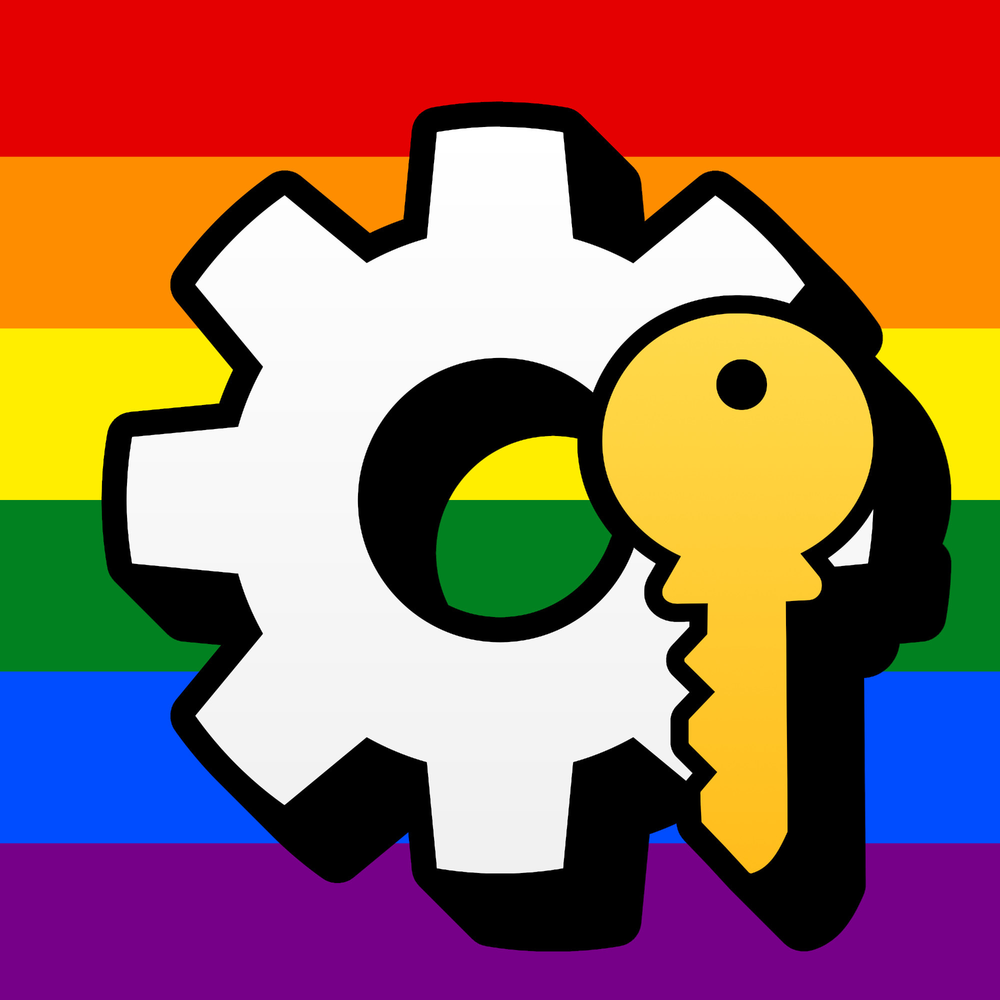

<blockquote class="bluesky-embed" data-bluesky-uri="at://did:plc:wvg35pljfowzru4pp6i2ky6z/app.bsky.feed.post/3lqkg6kvq7k2z" data-bluesky-cid="bafyreifv5ooi3oku2yimix6ujxjuqe5ny6gfwp2llya6itujvsrwl6nrli" data-bluesky-embed-color-mode="system">
Happy Pride Month to all the queer folks! 🌈  <a href="https://bsky.app/profile/did:plc:wvg35pljfowzru4pp6i2ky6z/post/3lqkg6kvq7k2z?ref_src=embed">[image or embed]</a>
&mdash; MAS (<a href="https://bsky.app/profile/did:plc:wvg35pljfowzru4pp6i2ky6z?ref_src=embed">@massgrave.dev</a>) <a href="https://bsky.app/profile/did:plc:wvg35pljfowzru4pp6i2ky6z/post/3lqkg6kvq7k2z?ref_src=embed">2025年6月1日 21:58</a></blockquote>

了解 MAS：[Microsoft-Activation-Scripts](https://github.com/massgravel/Microsoft-Activation-Scripts)

