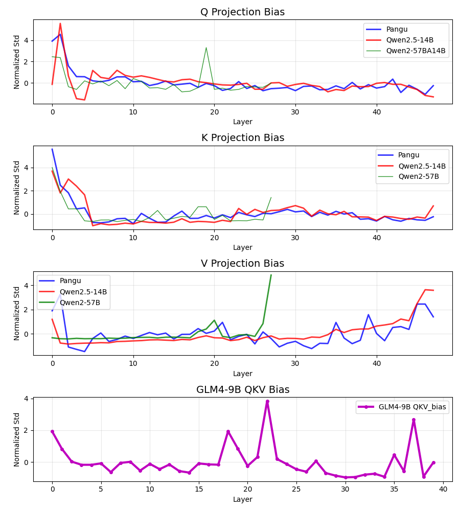

来源：<https://github.com/HonestyAGI/LLM-Fingerprint>

翻译：`gemini-2.5-pro`

---

# 诚实永不消亡

先前的 GitHub 仓库莫名其妙地消失了。这是一个重新上传的版本。

# 🔍 大语言模型的内在指纹：想偷模型？只靠继续训练可不够！

## 🎯 核心问题

随着训练成本飙升💸以及模型复用变得普遍，大语言模型（LLMs）面临着严重的**版权和知识产权盗窃**问题。传统的水印方法在持续训练攻击面前十分脆弱——作恶者只需进行更多的训练就能抹去水印！😱

## 💡 关键创新

研究人员发现了一种**简单而巧妙的方法**：分析模型各层注意力参数的**标准差模式**。这些模式就像独特的“指纹”🔬，具有以下特点：

- ✅ **鲁棒性强** - 能在大量的持续训练后依然存在
- ✅ **内在性** - 从模型架构中自然产生
- ✅ **简单易用** - 只需对参数矩阵使用 `torch.std()` 即可！

## 🔬 方法论

对于每个 Transformer 层，他们提取 Q、K、V、O 投影矩阵并计算：

```plain
σ = std(Matrix_parameters)
```

然后跨层进行归一化，以创建出独特的签名，即使在模型经过重大修改后也能识别其“血统”。

## 🚨 惊人发现

**重大发现**：华为的**盘古 Pro MoE 模型**与**Qwen-2.5 14B**模型显示出极高的相关性（0.927），这表明它很可能是通过“再利用升级（upcycling）”而非从零开始训练得来的！😲

这表明：

- 🚫 潜在的**版权侵犯**
- 📄 技术报告中存在**信息造假**
- 💸 对巨额训练投资的**虚假声明**

## 🧪 验证结果

该方法成功检测到了已知的模型“血统”关系：

- ✅ Llama-3.1-Nemotron（从 Llama-3.1-70B 微调而来）
- ✅ 各种 Qwen 衍生模型
- ✅ Qwen1.5-MoE（从 Qwen-1.8B 再利用升级而来）

## 🎯 影响与启示

- 🛡️ **保护**人工智能行业的**知识产权**
- 🔍 **高置信度地检测模型抄袭**
- ⚖️ 为版权执法提供**法律证据**
- 🌍 促进人工智能发展中的**透明度**和**问责制**

## ⚠️ 局限性

- 对**大型模型**（数十亿参数）效果最佳
- 对**小型模型**可能效果较差，因为统计功效有限
- 需要访问模型参数（而不仅仅是输出）

## 🔮 更广阔的背景

这项研究凸显了对可靠认证方法的**迫切需求**，因为：

- 💰 训练成本高达数百万美元
- 🏃‍♂️ 市场压力驱动着快速发展
- 🌐 地缘政治紧张局势影响着人工智能供应链
- 🎭 公司可能会为了展示能力而“抄近路”

## 💪 为何这很重要

在这个 **“想偷模型，只靠继续训练可不够”**的时代，这项工作为 AI 社区提供了实用工具，以维护**公平竞争**和**保护创新**，同时促进技术的持续进步！🚀

---

# 🆕 更新

根据开源大语言模型社区的反馈和建议，我们进一步检查了盘古及其他模型的更多架构模式。本次调查重点分析了 QKV 偏置投影（bias projections）和注意力层的归一化权重，使用了与我们论文中相同的归一化标准差测量方法。

## 🔬 QKV 偏置分析结果



QKV 偏置分析揭示了盘古和 Qwen2.5-14B 在所有三种投影类型（Q、K、V）上都存在惊人的相似性。两个模型表现出几乎相同的模式，特别是在早期层出现的特征性尖峰以及随后的收敛行为。这一点尤为重要，因为 QKV 偏置是 Qwen 1-2.5 代的一个独特设计特点（如其技术报告中所述：<https://arxiv.org/abs/2309.16609>），而包括 Qwen3 在内的大多数开源模型已经放弃了这种方法。

参考链接：

- <https://github.com/huggingface/transformers/blob/037755ed54208eefa77673b0af2a0b13e51f2fb1/src/transformers/models/qwen2/modeling_qwen2.py#L136>
- <https://gitcode.com/ascend-tribe/pangu-pro-moe-model/blob/main/modeling_pangu_moe.py#L303>

## 🔬 注意力层 LayerNorm 权重模式


注意力层 LayerNorm 权重的分析进一步加强了这些相似性。盘古和 Qwen2.5-14B 在整个层序列中表现出非常一致的趋势，其平行的初始化模式和收敛行为将它们与 Qwen2-57B-A14B 和 Qwen3-30A3B 等其他模型区分开来。

## 💡 超越参数：模型激活分析（进行中）


我们正在分析每一层的激活范数。我们在 The Pile 测试集（<https://pile.eleuther.ai/>）中随机抽取了 1000 批次的样本，并计算了激活值的范数。我们同样使用了逐层归一化的方法。批处理大小为 8，序列长度为 1024。初步结果已发布于此。盘古模型*仍然*与 Qwen 相似。这表明它们的计算模式存在大量重叠。

\*请注意，对于基于 Pre-Norm 的大语言模型，由于残差连接的存在，激活范数随层数增加是常见现象。

## 🔍 启示

这些架构上的相似性已经超出了巧合的设计选择。观察到的一致性几乎**无处不在**：QKVO 矩阵（见我们论文图 3）、FFN（见我们论文图 8）、QKV 偏置以及注意力层的 RMSNorm。这些*都是*一个大语言模型的*所有关键组成部分*。

**所有这些都只是巧合吗？很可能不是。**

一两种类型的重叠可能是巧合（另请参见我们论文的图 3，一些模型可能在 V 和 O 矩阵上存在重叠）。但在盘古的案例中，巧合**实在太多了**，我们正与开源社区一起调查更多的“巧合”。

请不要欺骗全世界的社区。

我们诚挚地邀请大语言模型社区的研究人员为此案提供更多证据。

💡最新消息：我们正在积极更新和补充我们的实验与分析。一些额外的结果 **（例如 Qwen 1.5 MoE/Qwen 2 MoE）**可以在这个 issue 中找到：<https://web.archive.org/web/20250704072239/https://github.com/HonestAGI/LLM-Fingerprint/issues/8> 。敬请关注 😁！

---

## 🤣 其他

- 我们还注意到，盘古的官方仓库异常地包含了 Qwen 2024 的许可证：
  <https://gitcode.com/ascend-tribe/pangu-pro-moe-model/blob/main/Open%20Source%20Software%20Notice>

    <https://gitcode.com/ascend-tribe/pangu-pro-moe-model/blob/main/configuration_pangu_moe.py#L3>

    <https://gitcode.com/ascend-tribe/pangu-pro-moe-model/blob/main/modeling_pangu_moe.py#L3>

由于 Qwen 2.5 系列是在 2024 年发布的，这与**我们的发现是一致的**。

- 我们注意到了 issue 中揭露的欺诈行为，这与**我们的发现是一致的**。

<https://web.archive.org/web/20250704010151/https://github.com/HonestAGI/LLM-Fingerprint/issues/2>

<https://web.archive.org/web/20250704010209/https://github.com/HonestAGI/LLM-Fingerprint/issues/4>

他们提到开发团队更改了模型的词表（vocabulary）。这可以解释为什么盘古和 Qwen 的词表大小不同（以及它们使用的 token）。开发者可能想通过这种刻意操作来掩盖他们的欺诈行为，因为使用相同的词表太容易被社区发现重叠了 🤣。这些 issue 还提到了通过在测试集上训练来进行基准测试作弊，但这不属于本项目的范围。

- 我们收到了来自多名（自称是）其团队内部的举报人的消息。他们证实了对盘古 Pro MoE 的指控，并确认存在一个与 DeepSeek-V3“非常相似”的盘古 Ultra MoE 版本（仍然是再利用升级，但方式不同，这与 issue 2 和 4 提供的信息相符）。尽管如此，这些消息无法核实，因为盘古 Ultra MoE 尚未发布，我们也无法确认这些举报人的身份。

---

_🤝 由诚实 AGI 社区（Honest AGI Community）执行 - 致力于促进 AI 发展的透明度与诚信_


