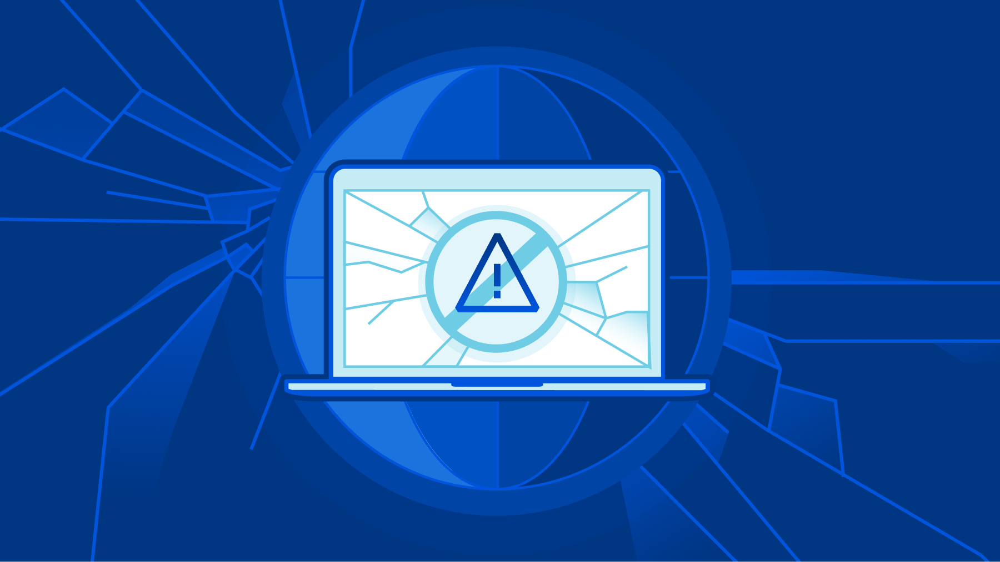
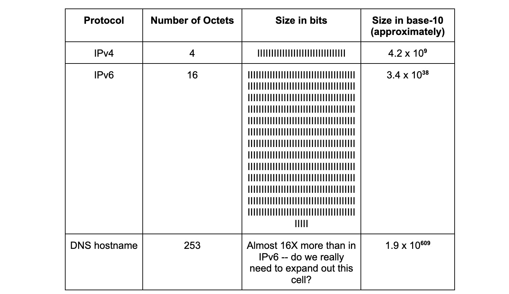
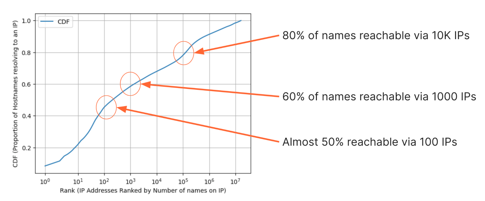

来源：<https://blog.cloudflare.com/zh-cn/consequences-of-ip-blocking/>

---

8 月底，Cloudflare 客户支持团队开始收到奥地利方面有关我们网络上的网站宕机的投诉。我们的团队立即采取行动，试图确定从外部看像是奥地利部分互联网中断的源头。我们很快意识到这是奥地利当地互联网服务提供商的问题。



但这一服务中断并不是技术问题造成的。正我们后来从[媒体报道](https://www.derstandard.de/story/2000138619757/ueberzogene-netzsperre-sorgt-fuer-probleme-im-oesterreichischen-internet)所知，我们看到的情况是一个法庭命令的结果。奥地利一家法院在没有通知 Cloudflare 的情况下，下令奥地利互联网服务提供商屏蔽 Cloudflare 的 11 个 IP 地址。

为了屏蔽版权所有者认为侵犯版权的 14 个网站，法院命令的 IP 屏蔽导致奥地利普通互联网用户在两天内无法访问数千个网站。其他成千上万的网站做错了什么呢？什么也没有。由于未能建立反映互联网实际架构的法律救济和系统，这些网站成为暂时的牺牲品。

今天，我们将深入讨论 IP 屏蔽：为什么会看到它，它是什么，它有什么作用，它影响了谁，以及为什么对于处理在线内容而言，它是非常有问题的方式。

## 间接影响，有大有小

最疯狂的是，在世界各地，类似的屏蔽经常发生。但是，除非这种屏蔽达到奥地利那样的规模，或者有人决定强调它，否则外界通常是看不见的。即使 Cloudflare 拥有深厚的技术专业知识，了解屏蔽的工作原理，但通常也无法看到一个 IP 地址何时被屏蔽。

对互联网用户来说，它就更加不透明了。他们通常不知道为什么不能连接到一个特定的网站，连接问题来自哪里，或者如何解决它。他们只是知道无法访问他们尝试访问的网站。因此，记录网站何时因为 IP 地址屏蔽而不可访问并不是容易的事情。

屏蔽的做法也是非常普遍的。Freedom House 最近在其 Freedom on the Net 报告中[指出](https://freedomhouse.org/report/freedom-net/2022/key-internet-controls)，在他们调查的 70 个国家中，有 40 个国家——从俄罗斯、伊朗和埃及到西方民主国家，如英国和德国——进行了某种形式的网站屏蔽。尽管报告没有深入介绍这些国家是如何屏蔽的，但其中许多国家使用 IP 屏蔽的形式，其潜在影响与我们在奥地利看到的局部互联网关闭相同。

尽管评估 IP 屏蔽带来的附带损害的数量可能具有挑战性，但有一些组织已试图对此进行量化。总部位于斯洛伐克的非营利组织欧洲信息社会研究所(European Information Society Institute)结合欧洲人权法院(European Court of Human Rights)的一个案例，在 2017 年回顾了俄罗斯屏蔽网站的制度。俄罗斯仅使用 IP 地址来屏蔽内容。欧洲信息社会研究所的结论是，IP 屏蔽导致 “_大规模的附带网站屏蔽_”，并指出，截至 2017 年 6 月 28 日，“俄罗斯有 6522629 个互联网资源被屏蔽，其中 6335850 个 (97%) 是间接（即在缺乏法律依据的情况下）遭到屏蔽的。”

在英国，过度屏蔽促使非营利组织“开放权利”(Open Rights Group)创建了网站 [Blocked.org.uk](https://www.blocked.org.uk/)。该网站有一个工具，可以让用户和网站所有者报告过度屏蔽情况，并要求 ISP 解除屏蔽。该组织也有数百个故事，涉及慈善机构到小企业主，讲述他们的网站被不当屏蔽后的影响。虽然并不总是很清楚使用了哪些屏蔽方法，但这个网站成为必要这一事实表明了过度屏蔽的程度。想象一下，一个裁缝、钟表匠或汽车经销商希望通过他们的网站宣传其服务，并可能获得新客户。如果本地用户无法访问网站，这一切将不起作用。

一种反应可能是：“好吧，只要确保受限制的网站不要与不受限制的网站共享地址就行了。” 但是，这忽略了可能的域名数量和可用的 IP 地址数量之间的巨大差异，并与赋能互联网的技术规范背道而驰。下文将详细讨论这一点。此外，不同国家、社区和组织对受限和不受限的定义也有所不同。即使有可能知道所有的限制，互联网本身及其协议的设计意味着，满足每个机构的限制是完全不可行的，甚至是不可能的。

## 法律和人权问题

过度屏蔽网站不仅是用户的问题；它还会带来法律后果。由于它会对希望在网上行使权利的普通公民产生影响，政府实体(包括法院和监管机构)有法律义务确保他们的命令是必要和相称的，并且不会不必要地影响那些没有造成伤害的人。

例如，很难想象，法院在回应被指控的不当行为时，会盲目地仅根据街道地址签发搜查令或命令，而不关心该地址是单户住宅、六单元的共管公寓大楼，还是拥有数百个独立单元的高层建筑。但这种使用 IP 地址的做法似乎非常盛行。

2020 年，欧洲人权法院(ECHR)——监督欧洲委员会《欧洲人权公约》执行情况的法院——审议了一个案件，涉及在俄罗斯被屏蔽的网站，其之所以被屏蔽，不是因为它是俄罗斯政府的目标，而是因为它与被屏蔽的网站共享一个 IP 地址。该网站的所有者提起了诉讼。欧洲人权法院的结论是，不加选择地屏蔽网站内容是不允许的，裁定屏蔽网站的合法内容 “_相当于对这些网站所有者权利的任意干涉_。” 换句话说，ECHR 裁定，政府发布命令导致非目标网站被屏蔽是不适当的。

## 利用互联网基础设施解决内容挑战

普通互联网用户不会过多考虑他们试图访问的在线内容是如何传递给他们的。他们认为，只要在浏览器中输入域名，内容就会自动弹出。如果没有，他们倾向于认为网站本身有问题，除非他们的整个互联网连接看来也中断了。但这些基本的假设忽略了一个现实，即与网站的连接经常被用来限制对在线内容的访问。

为什么国家会屏蔽网站连接？也许他们想限制自己的公民访问他们认为是非法的内容，比如在线赌博或露点内容，而这些内容在世界其他地方是允许的。也许他们想阻止人们看到他们认为主要是虚假信息的外国新闻来源。或者，他们可能想要支持版权所有者，以阻止访问某个网站，限制观看他们认为侵犯其知识产权的内容。

需要明确的是，**阻止访问与从互联网上删除内容不是一回事**。有各种法律义务和机构被设计来允许实际删除非法内容。事实上，在许多国家的法律预期是，屏蔽是试图从源头删除内容后的最后手段。

屏蔽只是阻止某些浏览者——那些互联网接入依赖于进行屏蔽的 ISP 的人——访问网站。网站本身继续存在于网上，其他人都可以访问。但是，当内容来自不同地方，无法轻易删除时，一个国家可能会将屏蔽视为他们最好或唯一的方法。

我们认识到有时促使各国采取屏蔽手段的担忧。但从根本上说，我们认为重要的是让用户知道他们试图访问的网站何时被屏蔽，以及在可能的情况下，是谁屏蔽了它们以及为什么。至关重要的是，对内容的任何限制都应该尽可能有限，以便在避免侵犯他人权利的前提下解决危害。

简单粗暴地屏蔽 IP 地址不允许做到上面这些。这种做法对互联网用户来说是完全不透明的。还会对其他内容产生意想不到、不可避免的后果。而互联网的结构意味着，在 IP 屏蔽之前或期间，都没有好的方法来确定哪些其他网站可能受到影响。

要了解在奥地利发生了什么，以及试图通过 IP 地址直接屏蔽内容的许多其他国家发生了什么，我们必须了解幕后发生了什么。这意味着要深入研究一些技术细节。

## 身份依附于名字，而不是地址

在我们开始描述屏蔽的技术现实之前，有必要强调的是，处理内容的第一个也是最好的选择是在源头。网站所有者或托管服务提供商可以选择精准地删除内容，而不必关闭整个网站。从更技术的角度来看，域名注册服务商或注册机构可以通过撤销一个域名来将整个网站从互联网下线。

但是，如果由于某种原因，内容所有者或内容来源无法或不愿将其从互联网上删除，您如何阻止对网站的访问呢？只有三个可能的控制点。

第一个是通过域名系统(DNS)，它将域名转换为 IP 地址，以便找到网站。DNS 解析器可以撒谎并返回代码 NXDOMAIN，而不是为域名返回一个有效的 IP 地址，这意味着“没有这个名称”。更好的方法是使用 [2020 年标准化的](https://datatracker.ietf.org/doc/rfc8914/)诚实错误代码，包括错误 15 表示屏蔽，错误 16 表示审查，错误 17 表示过滤，或错误 18 表示禁止，尽管这些错误代码目前并未广泛使用。

有趣的是，DNS 作为控制点的准确性和有效性取决于 DNS 解析器是私有的还是公共的。私有或“内部” DNS 解析器由 ISP 和企业环境为他们自己的已知客户运行，这意味着运营商可以精确地应用内容限制。相比之下，开放或公共解析器是无法达到这种精确程度的，尤其是因为，路由和寻址在互联网地图上是全球性并不断变化的，这与固定的邮政或街道地图上的地址和路线形成鲜明的对比。例如，私有域名解析器可以在一定程度上准确屏蔽特定地理区域内的网站，而公共域名解析器却做不到这一点。鉴于世界各地不同(且不一致)的屏蔽机制，这一点非常重要。

第二种方法是阻止对受限制域名的个别连接请求。当用户或客户端想要访问一个网站时，客户端会发起一个到服务器*名称*(即域名)的连接。如果网络或在路径上的设备能够观察到服务器的名称，那么连接可以终止。与 DNS 不同，没有机制告诉用户对服务器名的访问被阻止，以及为什么。

第三种方法是阻止访问可以找到域名的 IP 地址。这有点像阻止所有邮件投递到某个物理地址。想象一下，如果该地址是一座摩天大楼，其中有许多不相关的独立居住者。停止向摩天大楼的地址投递邮件必然会影响到该地址的所有各方，从而造成附带损害。IP 地址的工作原理与此相同。

值得注意的是，IP 地址是三个选项中唯一与域名无关的选项。路由和数据包传递不需要网站域名；事实上，它完全被忽略了。一个网站可以在任何 IP 地址上访问，甚至可以同时在多个 IP 地址上访问。而且网站所在的 IP 地址集可以随时更改。自 1995 年以来，IP 地址集不能通过查询 DNS 来*确定*，DNS 一直能够在任何时间以任何原因返回任何有效地址。

地址代表身份的想法对互联网的设计来说是一种诅咒，因为地址与名称的分离深深嵌入了互联网标准和协议中，接下来会解释这一点。

## 互联网是一组协议，而不是一个策略或视角

许多人仍然错误地认为 IP 地址代表一个网站。我们之前已经[说过](https://blog.cloudflare.com/addressing-agility/)，名字和地址之间的关联是可以理解的，因为互联网最早的连接组件表现为一台电脑、一个接口、一个地址和一个名字。这种一对一的关联是部署互联网协议的生态系统的产物，满足了当时的需求。

尽管早期互联网采用一对一命名的做法，但始终可以为一台服务器(或“主机”)分配多个名称。例如，服务器过去(现在仍然)往往配置各种名称以反映其提供的服务，例如 `mail.example.com` 和 `www.example.com`，但是这些名称共享一个基本域名。在需要将完全不同的网站放在一台服务器上之前，几乎没有理由使用完全不同的域名。在 1997 年，通过 HTTP/1.1 中的 **Host** 标头，这种做法变得更加容易。这一特性在 2003 年的 [TLS 扩展](https://datatracker.ietf.org/doc/rfc3546/)中通过 SNI 字段予以保留。

在这些变化中，互联网协议和单独的 DNS 协议不仅跟上了步伐，而且基本没有改变。它们正是互联网能够扩展和进化的原因，因为它们是关于地址、可达性和任意名称到 IP 地址的关系。

IP 和 DNS 的设计也是完全独立的，这只会加强名称与地址的分离这一事实。仔细检查协议的设计元素表明了，对策略的误解导致了今天通过阻止 IP 地址来控制内容访问的普遍做法。

### 从设计上讲，IP 仅是为了实现可达性

就像大型公共土木工程项目依赖于建筑规范和最佳实践一样，互联网是使用一套*开放的*标准和规范来构建的，这些标准和规范由经验和国际共识决定。连接硬件和应用程序的互联网标准是由互联网工程任务组 ([IETF](https://www.ietf.org/)) 以“征求意见书” ([RFC](https://www.ietf.org/standards/rfcs/))形式发布的 —— 如此命名并非表示不完整，而是反映标准必须能够随着知识和经验的发展而演变。 IETF 及其 RFC 植根于通信的结构中，例如，第一份征求意见书 RFC 1 发布于 1969 年。互联网协议 (IP) 规范在 1981 年达到 [RFC 状态](https://datatracker.ietf.org/doc/rfc791/)。

除了标准组织，互联网的成功还得益于一个被称为端到端(e2e)原则的核心思想，这一次思想也是在 1981 年[编纂](https://web.mit.edu/Saltzer/www/publications/endtoend/endtoend.pdf)的，其基于多年的试验和错误[经验](https://en.wikipedia.org/wiki/End-to-end_principle)。端到端原则是一个强大的抽象概念，尽管有多种形式，但它体现了互联网协议规范的一个核心观念：网络的唯一责任是建立可达性，而其他任何可能的功能都具有成本或风险。

互联网协议中的“可达性”理念也体现在 IP 地址本身的设计中。根据互联网协议规范 [RFC 791](https://www.rfc-editor.org/rfc/rfc791)，如下摘自 2.3 节的内容明确了 IP 地址与名称、接口或其他任何东西没有关联。

就像现实世界中摩天大楼的邮政地址一样，IP 地址只不过是写在纸上的街道地址。就像纸上的街道地址一样，人们永远无法完全确定 IP 地址背后的实体或组织是什么。在类似 Cloudflare 的网络中，任何一个 IP 地址都代表着[数千个服务器](https://blog.cloudflare.com/cloudflare-architecture-and-how-bpf-eats-the-world/)，以及甚至更多的网站和服务，某些情况下数以[百万计](https://blog.cloudflare.com/addressing-agility/) —— 显然是互联网协议的设计使这成为可能。

```bash
Addressing

    A distinction is made between names, addresses, and routes [4].   A
    name indicates what we seek.  An address indicates where it is.  A
    route indicates how to get there.  The internet protocol deals
    primarily with addresses.  It is the task of higher level (i.e.,
    host-to-host or application) protocols to make the mapping from
    names to addresses.   The internet module maps internet addresses to
    local net addresses.  It is the task of lower level (i.e., local net
    or gateways) procedures to make the mapping from local net addresses
    to routes.
                            [ RFC 791, 1981 ]
```

这里有一个有趣的问题：我们或任何内容服务提供商能否确保每个 IP 地址匹配一个且只有一个名称？答案是明确的**否定**，这也是因为协议设计 —— 本例中是 DNS。

### DNS 中的名称数量总是超过可用的地址

鉴于互联网规范，名称和地址之间的一对一关系是不可能的，原因与在物理世界中不可行的原因相同。暂时忽略个人和组织可以更改地址的事实。从根本上说，世界上的人和组织的数量超过了邮政地址的数量。我们不仅希望，而且*需要*互联网容纳的名称超过地址。

名称和地址之间的大小差异也写入了规范。IPv4 地址是 32 位，IPv6 地址是 128 位。可以通过 DNS 查询的域名大小为 253 个八位位组， 即 2024 位 (摘自 [RFC 1035](https://datatracker.ietf.org/doc/rfc1035/) 2.3.4 节，1987 年发布)。下面的表格更直观地显示了以上差异：

2022 年 11 月 15 日，联合国宣布地球人口超过 80 亿。凭直觉，我们就知道不可能有这么多邮政地址。地球上可能出现的名字的数量之差，和互联网上的名字的数量之差，确实而且必须超过可用地址的数量。



## 证据就在布丁名称里!

现在我们已经理解了国际标准中关于 IP 地址和 DNS 名称的两个相关原则 —— 即 IP 地址和域名的用途不同，两者之间没有一对一的关系 —— 研究最近使用 IP 地址屏蔽内容的案例，可以帮助我们展示这种做法有问题的原因。以 2022 年 8 月底奥地利发生的 IP 屏蔽事件为例。目标是通过阻止 11 个 IP 地址来限制对 14 个目标域的访问。 (数据来源： RTR.Telekom。通过 [Internet Archive](https://web.archive.org/web/20220828220559/http://netzsperre.liwest.at/) 发布的帖子) —— 这两个数字之间的不匹配应该是一个警告标志，说明 IP 屏蔽可能没有达到预期的效果。

类比和国际标准或许解释了应该避免 IP 屏蔽的原因，但通过观察互联网规模的数据，我们可以看到问题的规模。为了更好地理解和解释 IP 屏蔽的严重性，我们决定生成一个域名和 IP 地址的全球视图(感谢博士研究实习生 Sudheesh Singanamalla 的努力)。2022 年 9 月，我们使用针对顶级域名(TLD) .com、.net、.info 和 .org 的权威区域文件，加上排名前 100 万的网站名单，找到了共计 255315270 个唯一的名称。然后，我们从五个区域的每个区域查询 DNS，并记录返回的 IP 地址集。下表总结了我们的结果：

上表清楚地表明，地球上任何地区只需要不超过 1070 万个地址就能到达 255315270 个名字，而这些名字的 IP 地址集总数大约是 1600 万个——名称与 IP 地址的比率在欧洲接近 24 倍，在全球是 16 倍。


关于上述数字还有一个值得注意的细节：这些 IP 地址是 IPv4 和 IPv6 地址的总和，这意味着访问所有 2.55 亿个网站所需的地址要少得多。

我们还以几种不同的方式检查了数据，发现了一些有趣的观察结果。例如，下图显示了每增加一个 IP 地址可以访问的网站比例的累积分布(CDF)。y 轴是访问给定数量的 IP 地址可访问的网站的比例。在 x 轴上，1600 万个 IP 地址从左边最多的域到右边最少的域进行排名。请注意，此集中的任何 IP 地址都是来自 DNS 的响应，因此它必须至少有一个域名，但该集中 IP 地址上的域的最高数量达到百万级别。

通过观察 CDF，有一些令人难以想象的观察结果：



- 不到 10 个 IP 地址就可以到达集合中 20% 的域，即大约 5100 万个域；
- 100 个 IP 足以到达几乎 50% 的域名；
- 1000 个 IP 足以到达 60% 的域名；
- 1 万个 IP 足以到达 80% 的域，即 2.04 亿个。

事实上，在总共 1600 万个地址中，只有不到一半，即 710 万个地址(43.7%)有一个名称。关于这个“一”，我们必须特别说明：我们无法确定这些地址上是否只有一个名称而没有其他名称， 因为这些地址上的域名比仅包含在 .com、.org、.info 和 .net 中的域名多得多——这些地址上很可能还有其他名字。

除了在一个 IP 地址上有多个域之外，任何 IP 地址都可能随着时间的推移而变化。定期更改 IP 地址有助于提高网站的安全性、性能和可靠性。很多网站运营使用的一个常见例子是负载平衡。这意味着，随着时间的推移或者在不同的地方，DNS 查询可能为相同的网站返回不同的 IP 地址。这进一步解释了为什么屏蔽 IP 地址随着时间的推移将无法达到预期的目的。

最终，**如果没有及时检查地球上每个地点的 DNS 中的所有名称，就没有可靠的方法来知道一个 IP 地址上的域名数量**，这是一个完全不可行的命题。

根据管理和驱动互联网协议的定义，对 IP 地址的任何行动都必会产生附带影响。

## IP 屏蔽缺乏透明度

所以，如果我们预期屏蔽一个 IP 地址必定产生附带影响，而且人们普遍认为，通过屏蔽拥有多个域的 IP 地址来过度屏蔽是不合适的，甚至在法律上是不允许的，为什么这种情况仍然会发生呢？这很难确定，所以我们只能推测一下。有时，这反映出对可能产生的影响缺乏技术上的理解，特别像非技术人员的法官等实体。有时，政府只是忽略了附带损害——就像他们对互联网关闭所做的那样——因为他们认为屏蔽符合其利益。当出现附带损害时，从外界看来通常并不明显，所以要求解决这个问题的外部压力非常小。

这一点值得强调。当一个 IP 被屏蔽时，用户只能看到一个失败的连接。他们不知道为什么连接失败，也不知道是谁造成的。另一方面，代表网站的服务器甚至不知道网站被屏蔽了，直到它开始收到关于网站不可用的投诉。对于这种过度屏蔽几乎没有任何透明度或问责机制。对于网站所有者来说，挑战屏蔽或因被不当屏蔽而寻求救济即使并非不可能，也是具有挑战性的。

包括[奥地利](https://www.rtr.at/TKP/was_wir_tun/telekommunikation/weitere-regulierungsthemen/netzneutralitaet/nn_blockings.de.html)在内的一些政府确实公布了生效的屏蔽名单，这是提高透明度的重要一步。但是由于我们已经讨论过的所有原因，发布 IP 地址并不能揭示所有可能被无意中屏蔽的网站。而且它也没有给那些受影响的网站提供一个挑战过度屏蔽的手段。同样，在现实世界的例子中，很难想象法院针对某座摩天大楼的命令不会张贴在门上，但在虚拟空间中，我们似乎经常跳过这种正当程序和通知要求。

我们认为，随着越来越多的国家推动屏蔽在线内容，讨论 IP 屏蔽的问题后果比以往任何时候都更加重要。不幸的是，ISP 经常使用 IP 屏蔽来实施这些要求。也许是该 ISP 比较新或不如较大的同行那样稳健，但大型 ISP 也采取了同样的做法，这是可以理解的，因为 IP 屏蔽花费的精力最少，而且在大多数设备上都是现成的手段。

随着越来越多的域包含在相同数量的 IP 地址上，这个问题只会变得更严重。

## 后续步骤

那么我们可以做什么？

我们认为，第一步是提高 IP 屏蔽使用的透明度。虽然我们不知道有什么全面的方法来记录 IP 屏蔽造成的附带损害，但我们相信可以采取一些措施来扩大对这一做法的认识。正如我们通过 Cloudflare Radar Outage Center 所做的那样，我们致力于开展突出这些见解的新举措。

我们也认识到，这是一个涉及整个互联网的问题，因此必须成为更广泛努力的一部分。鉴于根据 IP 地址屏蔽很有可能将导致对一系列不相关(和非目标)域的访问遭到限制，所有人都不应该这样做。因此，我们正在与公民社会伙伴和志同道合的公司进行合作，发出他们的声音，挑战将屏蔽 IP 地址作为处理内容挑战的一种方式，并指出他们看到的任何附带损害。

要明确的是，为了应对网络非法内容的挑战，各国需要建立法律机制，以尊重权利的方式删除或限制内容。我们相信，从源头处理内容几乎始终是最好的和必需的第一步。欧盟新的《数字服务法案》或《数字千年版权法》等法律提供了工具，可用于从源头上解决非法内容，同时尊重重要的正当程序原则。各国政府应注重以对他人权利影响最小、与人权期望保持一致的方式建立和应用法律机制。

很简单，这些需求不能通过屏蔽 IP 地址来满足。

我们将继续寻找新的方式来谈论网络活动和中断，特别是当它导致不必要的访问限制时。欢迎访问 [Cloudflare Radar](https://radar.cloudflare.com/)，以进一步了解有关我们在网上所见内容的更多洞察。
